# SolVoid Architecture Documentation

## 🏗️ System Architecture Overview

SolVoid implements a sophisticated multi-layered privacy protocol combining zero-knowledge cryptography, blockchain integration, and real-time analytics. The system is designed for enterprise-grade privacy while maintaining regulatory compliance.

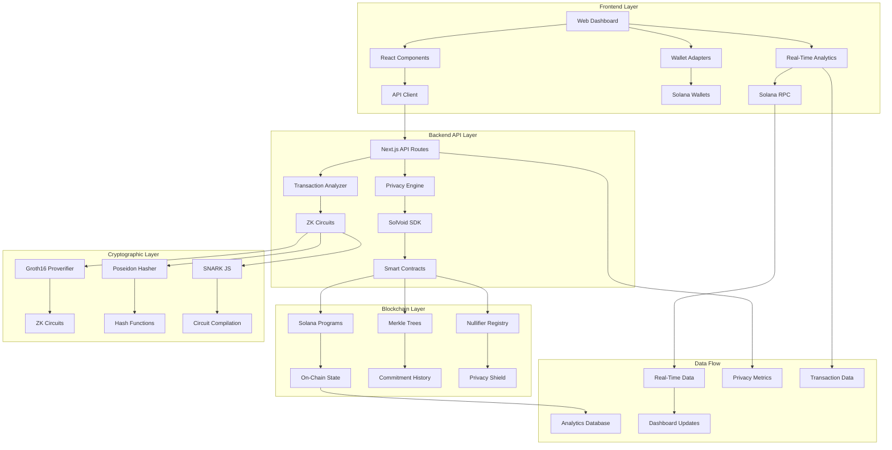

## 🔧 Component Architecture

### Frontend Layer (Netlify)
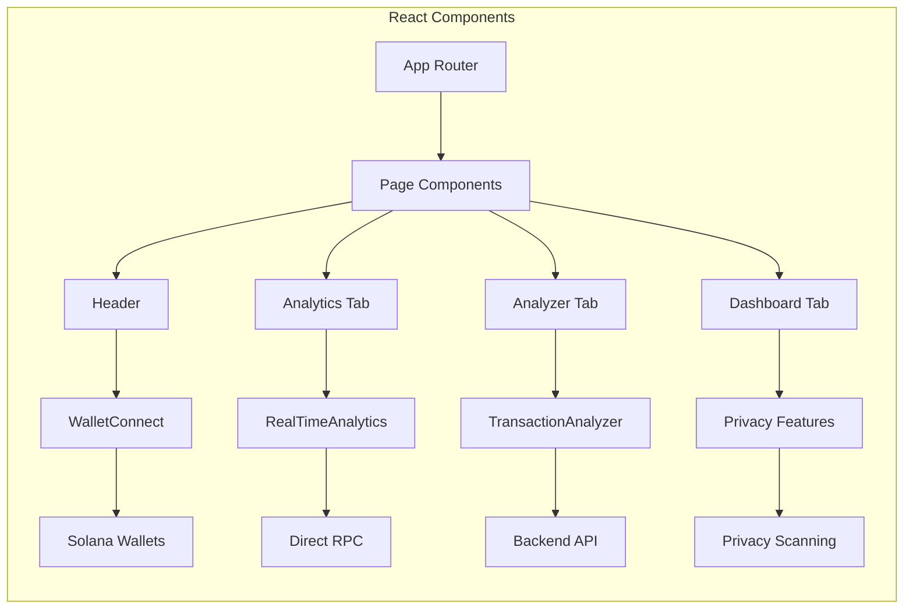

### Backend Layer (Vercel)
```mermaid
graph LR
    subgraph "API Routes"
        A[/api/solvoid] --> B[Privacy Engine]
        A --> C[Transaction Handler]
        A --> D[Shield Generator]
        B --> E[SDK Integration]
        C --> F[Blockchain Analysis]
        D --> G[ZK Operations]
    end
    
    subgraph "Business Logic"
        E --> H[Privacy Pipeline]
        F --> I[Transaction Parsing]
        G --> J[Circuit Execution]
        H --> K[Passport Manager]
        I --> L[Risk Assessment]
        J --> M[Proof Generation]
    end
```

### SDK Layer
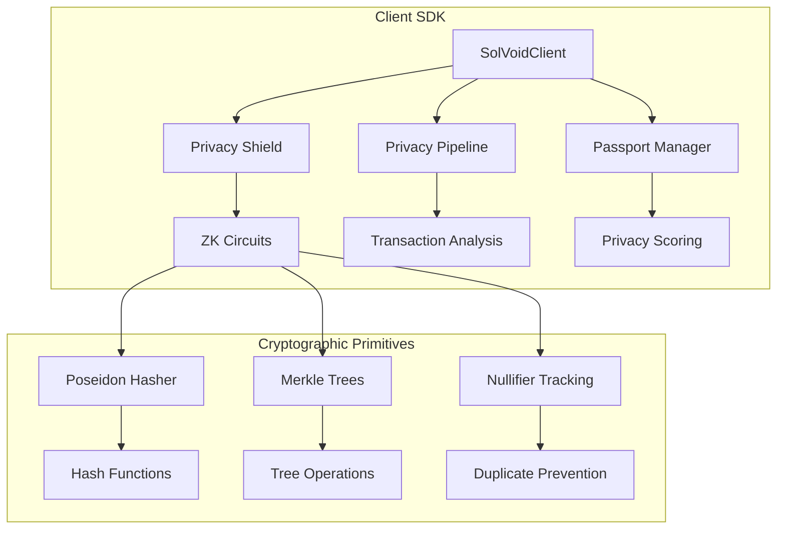

## 🔄 Data Flow Architecture

### Transaction Flow
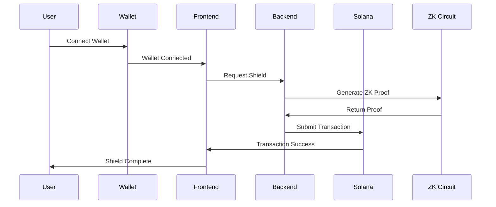

### Real-Time Analytics Flow
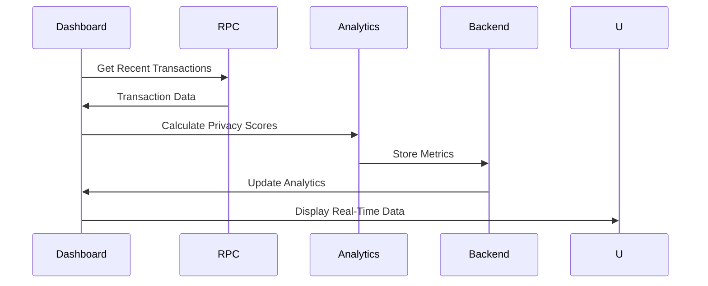

## 🛡️ Security Architecture

### Multi-Layer Security
```mermaid
graph TB
    subgraph "Application Security"
        A[Input Validation] --> B[Type Checking]
        B --> C[Sanitization]
        C --> D[Rate Limiting]
    end
    
    subgraph "Data Security"
        E[Encryption] --> F[Key Management]
        F --> G[Access Control]
        G --> H[Audit Logging]
    end
    
    subgraph "Blockchain Security"
        I[Multi-Sig Validation] --> J[Threshold Checks]
        J --> K[Nullifier Prevention]
        K --> L[Root Consensus]
    end
    
    subgraph "Cryptographic Security"
        M[Zero-Knowledge] --> N[Proof Verification]
        N --> O[Hash Verification]
        O --> P[Signature Validation]
    end
```

## 📊 Data Architecture

### Database Schema
```mermaid
erDiagram
    PRIVACY_PASSPORT ||--o{ has: } WALLET_ADDRESS
    WALLET_ADDRESS ||--o{ contains: } TRANSACTION_SIGNATURE
    TRANSACTION_SIGNATURE ||--o{ has: } PRIVACY_SCORE
    PRIVACY_SCORE ||--o{ tracks: } SCORE_HISTORY
    SCORE_HISTORY ||--o{ timestamp: number, score: number }
    
    COMMITMENT_TREE ||--o{ contains: } COMMITMENT
    COMMITMENT ||--o{ has: } NULLIFIER
    NULLIFIER ||--o{ prevents: } DOUBLE_SPEND
```

### Analytics Data Flow
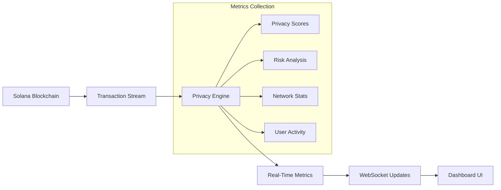

## 🚀 Deployment Architecture

### Hybrid Deployment Strategy
```mermaid
graph TB
    subgraph "Frontend (Netlify)"
        A[Static Build] --> B[Global CDN]
        B --> C[Edge Functions]
        C --> D[Browser Clients]
        D --> E[Wallet Connection]
        E --> F[Direct RPC]
    end
    
    subgraph "Backend (Vercel)"
        G[Serverless Functions] --> H[API Endpoints]
        H --> I[SolVoid SDK]
        I --> J[ZK Circuits]
        J --> K[Smart Contracts]
        K --> L[Solana Blockchain]
    end
    
    subgraph "Infrastructure"
        M[GitHub Actions] --> N[CI/CD Pipeline]
        N --> O[Automated Testing]
        O --> P[Production Deploy]
        P --> Q[Monitoring]
    end
```

## 🔧 Technology Stack

### Frontend Technology Stack
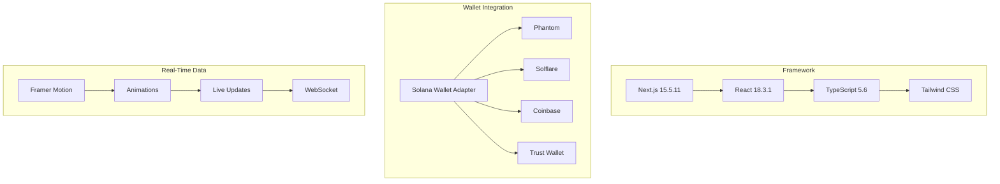

### Backend Technology Stack
```mermaid
graph TB
    subgraph "Runtime"
        A[Node.js 18+] --> B[Next.js API]
        B --> C[TypeScript]
        C --> D[Vercel Functions]
    end
    
    subgraph "Blockchain"
        E[Solana Web3.js] --> F[RPC Connection]
        F --> G[Devnet/Mainnet]
        G --> H[Smart Contracts]
    end
    
    subgraph "Cryptography"
        I[Circomlib] --> J[ZK Circuits]
        J --> K[SNARK JS]
        K --> L[Groth16]
        L --> M[Proof Verification]
    end
```

### SDK Technology Stack
```mermaid
graph TB
    subgraph "Core Library"
        A[TypeScript] --> B[ES6 Modules]
        B --> C[Browser Compatible]
        C --> D[Node.js Compatible]
    end
    
    subgraph "Dependencies"
        E[@solana/web3.js] --> F[Blockchain]
        E --> G[Token Programs]
        E --> H[Wallet Adapters]
        
        I[Circomlibjs] --> J[ZK Circuits]
        I --> K[Proof Systems]
        I --> L[Verifier]
        
        M[snarkjs] --> N[Proof Generation]
        N --> O[Groth16]
        O --> P[Verification]
    end
```

## 📈 Monitoring & Observability

### Monitoring Architecture
```mermaid
graph TB
    subgraph "Application Monitoring"
        A[Frontend Metrics] --> B[Performance Data]
        B --> C[Analytics Dashboard]
        C --> D[Alert System]
    end
    
    subgraph "Backend Monitoring"
        E[API Metrics] --> F[Response Times]
        F --> G[Error Tracking]
        G --> H[Log Aggregation]
    end
    
    subgraph "Blockchain Monitoring"
        I[RPC Health] --> J[Network Status]
        J --> K[Transaction Throughput]
        K --> L[Gas Optimization]
    end
```

### Alert System
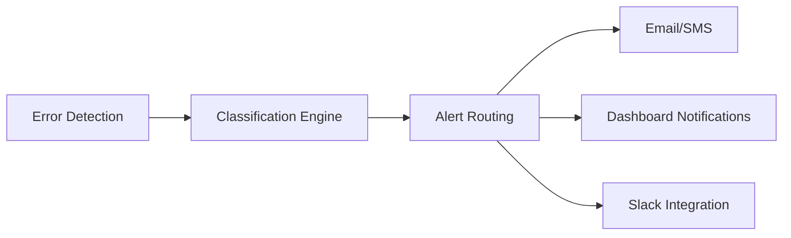

## 🔐 Privacy & Compliance

### Privacy-First Design
```mermaid
graph TB
    subgraph "Data Minimization"
        A[Transaction Data] --> B[Zero-Knowledge Proofs]
        B --> C[No On-Chain Exposure]
        C --> D[Complete Privacy]
    end
    
    subgraph "Anonymity Layer"
        E[Mixer Networks] --> F[Transaction Obfuscation]
        F --> G[IP Rotation]
        G --> H[Unlinkable Transactions]
    end
    
    subgraph "Compliance Layer"
        I[Regulatory Reporting] --> J[Audit Trails]
        J --> K[Compliance Reports]
        K --> L[Legal Documentation]
    end
```

## 🎯 Performance Optimization

### Caching Strategy
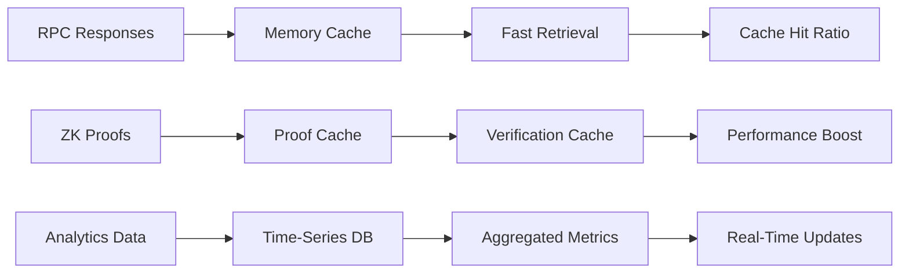

### Load Balancing
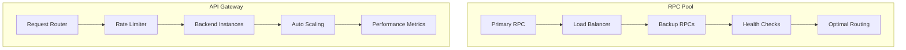

## 📚 Documentation Structure

### Documentation Hierarchy
```
/docs/
├── README.md                 # Main documentation
├── ARCHITECTURE.md          # System architecture
├── API.md                   # API documentation
├── SDK.md                   # SDK documentation
├── DEPLOYMENT.md            # Deployment guide
├── SECURITY.md              # Security documentation
├── PRIVACY.md               # Privacy features
├── COMPLIANCE.md           # Regulatory compliance
└── CONTRIBUTING.md           # Development guide
```

This architecture documentation provides a comprehensive overview of the SolVoid system, demonstrating how all components work together to provide enterprise-grade privacy on the Solana blockchain. The modular design allows for easy scaling and maintenance while maintaining security and performance.
