# SolVoid Data Flow Documentation

## 🔄 Complete Data Flow Architecture

### 🎯 Overview
SolVoid implements a sophisticated data flow architecture that ensures real-time privacy monitoring, secure transaction processing, and comprehensive analytics while maintaining complete user privacy.

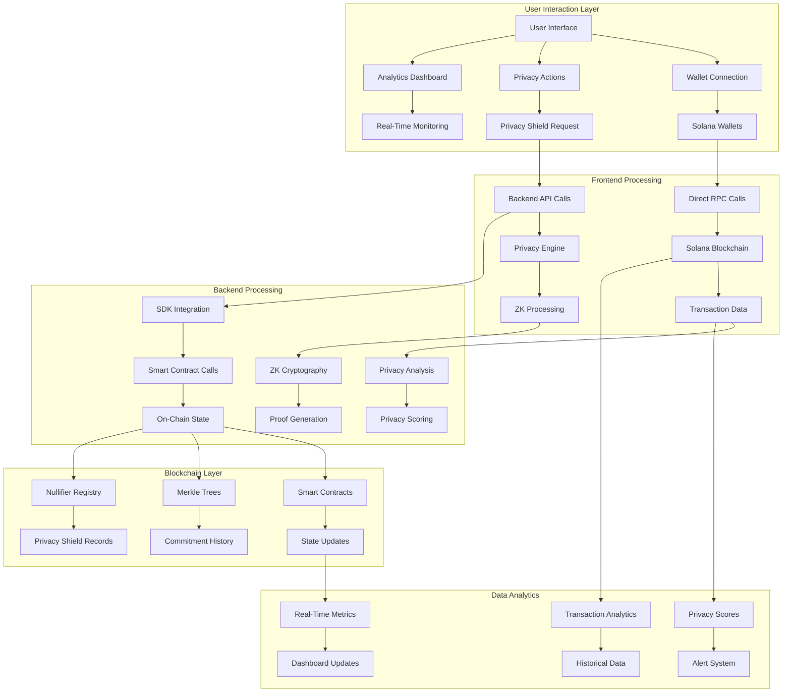

## 🔐 Transaction Shielding Flow

### Privacy Shield Generation Process
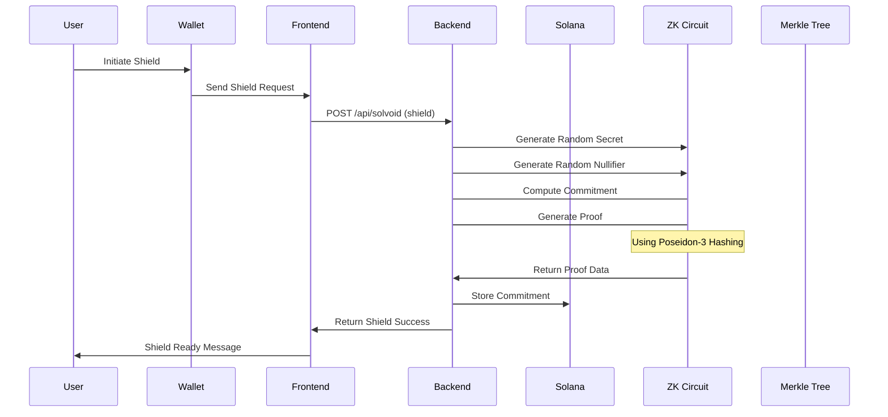

### ZK Proof Generation
```mermaid
graph TD
    A[Secret (32 bytes)] --> B[Nullifier (32 bytes)]
    A --> C[Poseidon Hash]
    B --> C
    
    C --> D[Amount (bigint)]
    D --> E[Commitment]
    E --> F[Merkle Tree]
    
    F --> G[Merkle Root]
    G --> H[ZK-SNARK Circuit]
    H --> I[Groth16 Proof]
    
    I --> J[Verification]
    J --> K[Proof Ready]
```

## 📊 Real-Time Analytics Flow

### Data Collection Pipeline
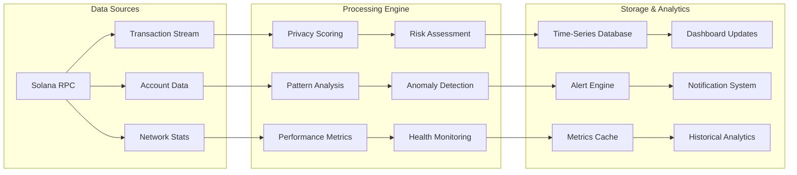

### Privacy Score Calculation
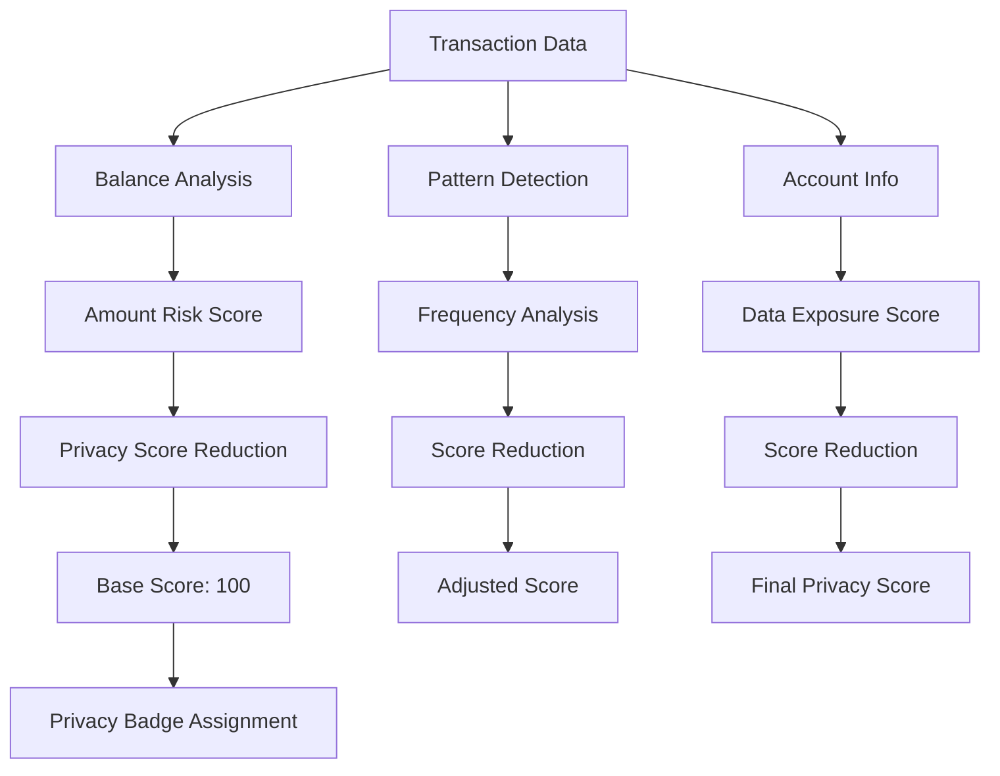

## 🔍 Privacy Scanning Flow

### Comprehensive Privacy Analysis
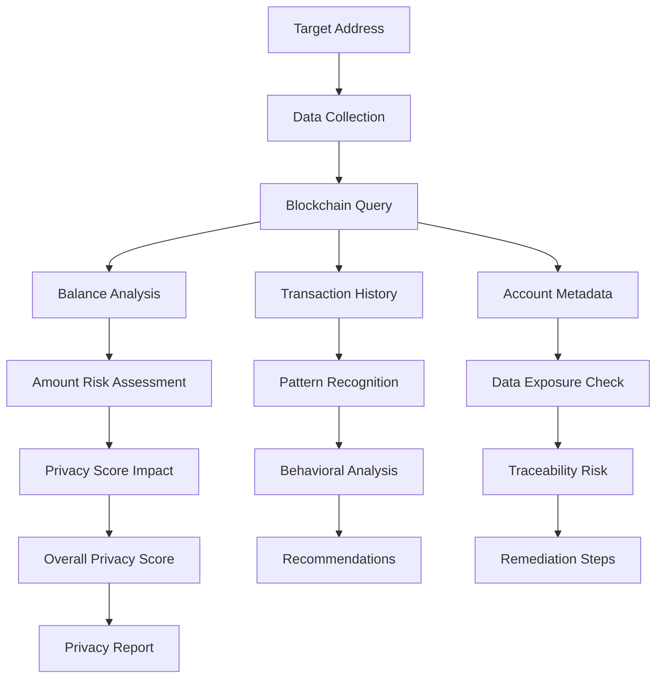

### Vulnerability Detection
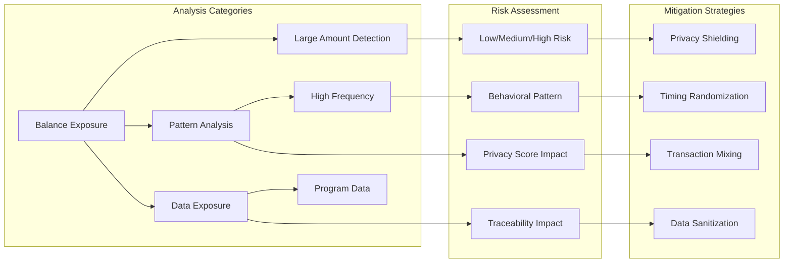

## 🔄 Backend API Data Flow

### API Request Processing
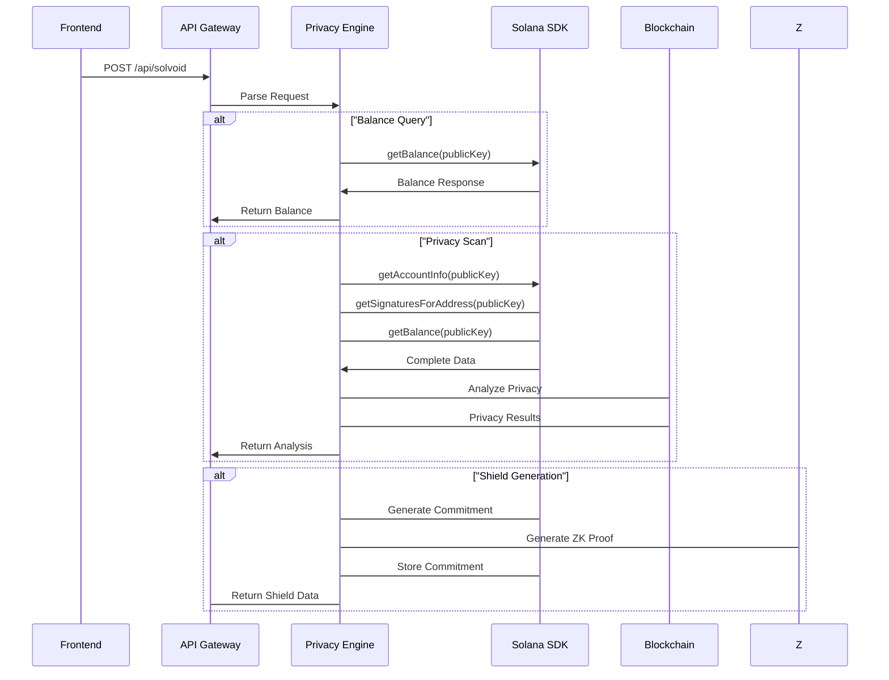

### SDK Integration
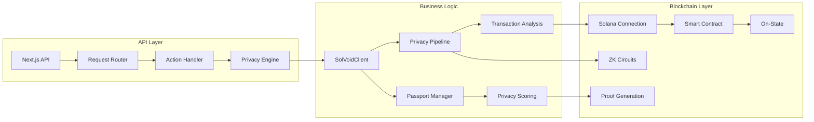

## 📈 Analytics Data Storage

### Real-Time Metrics Storage
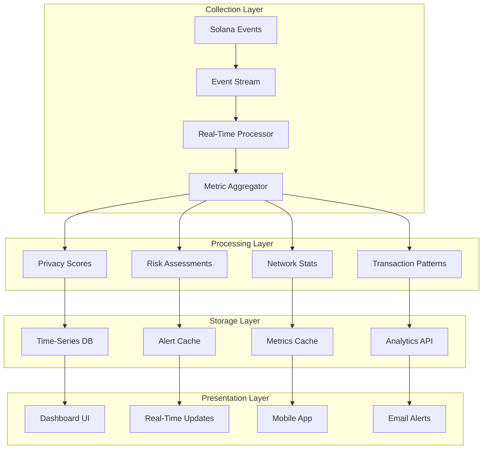

### Historical Data Management
```mermaid
graph LR
    subgraph "Data Collection"
        A[Current Metrics] --> B[Time-Series Storage]
        B --> C[Historical Database]
        C --> D[Trend Analysis]
    end
    
    subgraph "Data Processing"
        D --> E[Aggregation Engine]
        E --> F[Statistical Analysis]
        F --> G[Pattern Recognition]
        G --> H[Predictive Analytics]
    end
    
    subgraph "Data Presentation"
        H --> I[Historical Charts]
        I --> J[Trend Visualization]
        J --> K[Comparative Analysis]
        K --> L[Executive Dashboard]
    end
```

## 🚨 Error Handling & Recovery

### Error Propagation Flow
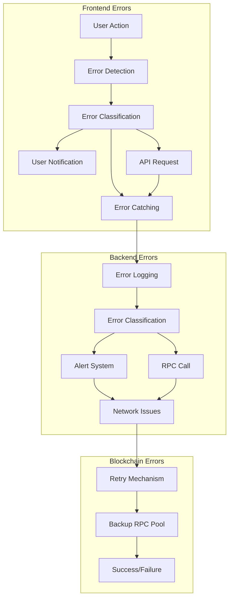

### Recovery Mechanisms
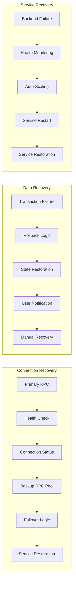

This comprehensive data flow documentation illustrates how SolVoid handles real-time data processing, privacy analysis, and secure transaction processing while maintaining complete user privacy and system reliability.
