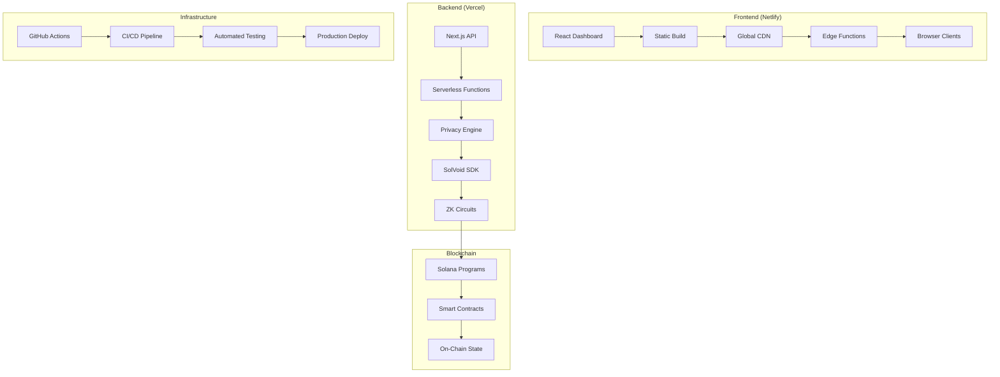
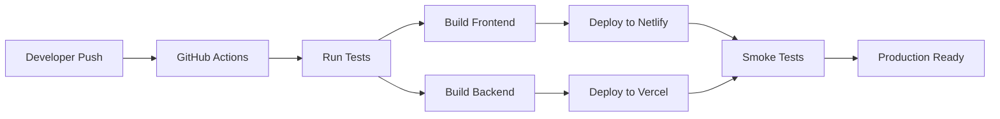
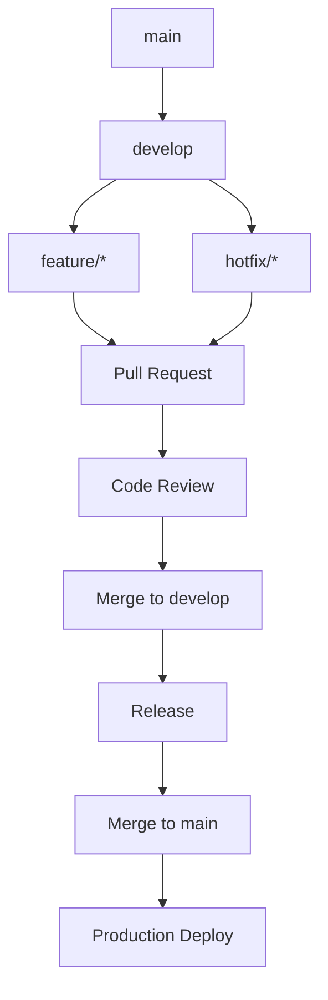

# SolVoid Deployment Guide

## 🚀 Hybrid Deployment Architecture

### 📋 Overview
SolVoid uses a hybrid deployment strategy separating frontend and backend concerns for optimal performance, scalability, and security.



## 🌐 Frontend Deployment (Netlify)

### Prerequisites
- Netlify account
- GitHub repository
- Domain name (optional)

### Deployment Steps

#### 1. Build Configuration
```bash
# Install dependencies
npm install

# Build for production
npm run build

# Test build locally
npm run start
```

#### 2. Netlify Configuration
Create `netlify.toml`:
```toml
[build]
  publish = ".next"
  command = "npm run build"

[build.environment]
  NODE_VERSION = "18"

[[redirects]]
  from = "/home"
  to = "/"
  status = 301

[[redirects]]
  from = "/api/*"
  to = "https://your-backend.vercel.app/api/:splat"
  status = 200

[[headers]]
  for = "/*"
  [headers.values]
    X-Frame-Options = "DENY"
    X-XSS-Protection = "1; mode=block"
    X-Content-Type-Options = "nosniff"
    Referrer-Policy = "strict-origin-when-cross-origin"
```

#### 3. Environment Variables
Set in Netlify dashboard:
```
NEXT_PUBLIC_API_URL=https://your-backend.vercel.app
NEXT_PUBLIC_RPC_URL=https://api.devnet.solana.com
NEXT_PUBLIC_PROGRAM_ID=Fg6PaFpoGXkYsidMpSsu3SWJYEHp7rQU9YSTFNDQ4F5i
```

#### 4. Deployment Commands
```bash
# Using Netlify CLI
npm install -g netlify-cli
netlify login
netlify init
netlify deploy --prod

# Or connect GitHub repository for automatic deploys
```

## ⚙️ Backend Deployment (Vercel)

### Prerequisites
- Vercel account
- GitHub repository
- Environment variables

### Deployment Steps

#### 1. Backend Configuration
Create `vercel.json`:
```json
{
  "version": 2,
  "builds": [
    {
      "src": "src/app/api/**/*.ts",
      "use": "@vercel/node"
    }
  ],
  "routes": [
    {
      "src": "/api/(.*)",
      "dest": "/api/$1"
    }
  ],
  "env": {
    "NEXT_PUBLIC_RPC_URL": "https://api.devnet.solana.com",
    "NEXT_PUBLIC_PROGRAM_ID": "Fg6PaFpoGXkYsidMpSsu3SWJYEHp7rQU9YSTFNDQ4F5i"
  }
}
```

#### 2. Environment Variables
Set in Vercel dashboard:
```
NEXT_PUBLIC_RPC_URL=https://api.devnet.solana.com
NEXT_PUBLIC_PROGRAM_ID=Fg6PaFpoGXkYsidMpSsu3SWJYEHp7rQU9YSTFNDQ4F5i
CUSTOM_RPC_URL=
RELAYER_URL=
NODE_ENV=production
```

#### 3. Deployment Commands
```bash
# Using Vercel CLI
npm install -g vercel
vercel login
vercel --prod

# Or connect GitHub repository for automatic deploys
```

## 🔗 API Integration

### Frontend-Backend Communication
```typescript
// src/config/deployment.ts
export const getApiUrl = (endpoint: string) => {
  const backendUrl = process.env.NEXT_PUBLIC_API_URL || 'http://localhost:3000';
  return `${backendUrl}${endpoint}`;
};

// Usage in components
const response = await fetch(getApiUrl('/api/solvoid'), {
  method: 'POST',
  headers: { 'Content-Type': 'application/json' },
  body: JSON.stringify({ action: 'scan', params })
});
```

### API Endpoints
```typescript
// Available endpoints
GET  /api/solvoid          - API status
POST /api/solvoid          - Privacy operations
POST /api/solvoid/scan     - Privacy scanning
POST /api/solvoid/shield   - Privacy shielding
POST /api/solvoid/rescue   - Wallet rescue
```

## 🛠️ Automated Deployment

### GitHub Actions Workflow
Create `.github/workflows/deploy.yml`:
```yaml
name: Deploy SolVoid

on:
  push:
    branches: [main]
  pull_request:
    branches: [main]

jobs:
  test:
    runs-on: ubuntu-latest
    steps:
      - uses: actions/checkout@v3
      - uses: actions/setup-node@v3
        with:
          node-version: '18'
      - run: npm ci
      - run: npm run test
      - run: npm run build

  deploy-frontend:
    needs: test
    runs-on: ubuntu-latest
    steps:
      - uses: actions/checkout@v3
      - name: Deploy to Netlify
        uses: netlify/actions/cli@master
        with:
          args: deploy --prod --dir=.next
        env:
          NETLIFY_AUTH_TOKEN: ${{ secrets.NETLIFY_AUTH_TOKEN }}
          NETLIFY_SITE_ID: ${{ secrets.NETLIFY_SITE_ID }}

  deploy-backend:
    needs: test
    runs-on: ubuntu-latest
    steps:
      - uses: actions/checkout@v3
      - name: Deploy to Vercel
        uses: amondnet/vercel-action@v20
        with:
          vercel-token: ${{ secrets.VERCEL_TOKEN }}
          vercel-org-id: ${{ secrets.ORG_ID }}
          vercel-project-id: ${{ secrets.PROJECT_ID }}
          working-directory: ./
```

### Secrets Configuration
Add to GitHub repository settings:
```
NETLIFY_AUTH_TOKEN
NETLIFY_SITE_ID
VERCEL_TOKEN
ORG_ID
PROJECT_ID
```

## 🔒 Security Configuration

### Frontend Security
```toml
# netlify.toml security headers
[[headers]]
  for = "/*"
  [headers.values]
    X-Frame-Options = "DENY"
    X-XSS-Protection = "1; mode=block"
    X-Content-Type-Options = "nosniff"
    Referrer-Policy = "strict-origin-when-cross-origin"
    Content-Security-Policy = "default-src 'self'; script-src 'self' 'unsafe-inline'; style-src 'self' 'unsafe-inline'; img-src 'self' data: https:; connect-src 'self' https://api.devnet.solana.com"
```

### Backend Security
```typescript
// API rate limiting
import rateLimit from 'express-rate-limit';

const limiter = rateLimit({
  windowMs: 15 * 60 * 1000, // 15 minutes
  max: 100, // limit each IP to 100 requests per windowMs
  message: 'Too many requests from this IP'
});

// CORS configuration
app.use(cors({
  origin: ['https://your-frontend.netlify.app'],
  credentials: true
}));
```

## 📊 Monitoring & Logging

### Frontend Monitoring
```typescript
// Error tracking
window.addEventListener('error', (event) => {
  console.error('Frontend error:', event.error);
  // Send to monitoring service
});

// Performance monitoring
const observer = new PerformanceObserver((list) => {
  for (const entry of list.getEntries()) {
    console.log('Performance:', entry.name, entry.duration);
  }
});
observer.observe({ entryTypes: ['navigation', 'resource'] });
```

### Backend Monitoring
```typescript
// API logging
app.use((req, res, next) => {
  console.log(`${new Date().toISOString()} ${req.method} ${req.path}`);
  next();
});

// Error handling
app.use((err, req, res, next) => {
  console.error('Backend error:', err);
  res.status(500).json({ error: 'Internal server error' });
});
```

## 🔄 CI/CD Pipeline

### Development Workflow


### Branch Strategy


## 🚀 Production Checklist

### Pre-Deployment
- [ ] All tests passing
- [ ] Build successful
- [ ] Environment variables configured
- [ ] Security headers set
- [ ] Rate limiting configured
- [ ] Monitoring enabled
- [ ] Backup strategy in place
- [ ] Documentation updated

### Post-Deployment
- [ ] Smoke tests passed
- [ ] API endpoints responding
- [ ] Frontend loading correctly
- [ ] Wallet connection working
- [ ] Real-time data flowing
- [ ] Error monitoring active
- [ ] Performance metrics collected

## 🔧 Troubleshooting

### Common Issues

#### Frontend Issues
```bash
# Build errors
npm run build --verbose

# Dependency issues
rm -rf node_modules package-lock.json
npm install

# Environment variable issues
echo $NEXT_PUBLIC_API_URL
```

#### Backend Issues
```bash
# API errors
vercel logs

# Build issues
npm run build

# Environment issues
vercel env ls
```

#### Integration Issues
```bash
# API connectivity
curl -X POST https://your-backend.vercel.app/api/solvoid

# CORS issues
curl -H "Origin: https://your-frontend.netlify.app" \
     -H "Access-Control-Request-Method: POST" \
     -H "Access-Control-Request-Headers: Content-Type" \
     -X OPTIONS https://your-backend.vercel.app/api/solvoid
```

This deployment guide provides comprehensive instructions for deploying SolVoid's hybrid architecture with proper security, monitoring, and CI/CD practices.
