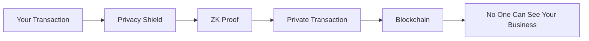
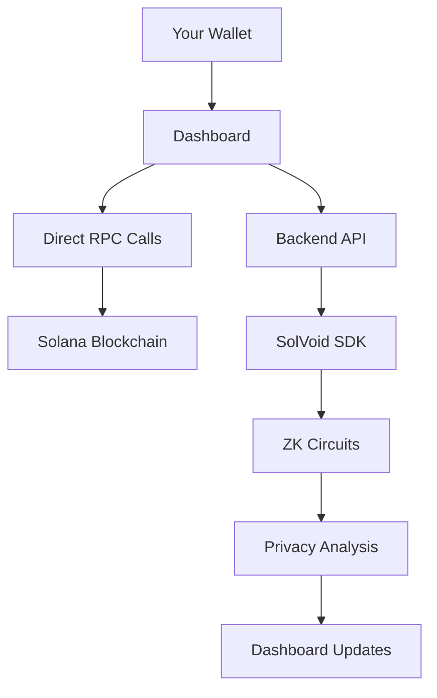

# SolVoid Developer Guide

## 👋 Hey Developer! Welcome to SolVoid

So you want to work on SolVoid? Awesome! This guide is written by developers, for developers. No corporate jargon, just real talk about how this privacy protocol works and how you can contribute.

## 🎯 What is SolVoid, Really?

Think of SolVoid as a **privacy cloak** for Solana transactions. It takes your regular Solana transactions and wraps them in zero-knowledge proofs, making them completely private while still being valid on the blockchain.

### The Core Idea


## 🛠️ How It Actually Works

### The Magic Behind the Scenes

1. **You want to send SOL privately** → SolVoid creates a "commitment" (like a sealed envelope)
2. **Generate ZK Proof** → Proves you have the right to send without revealing who you are
3. **Submit to blockchain** → Everyone can verify the proof but can't see the details
4. **Privacy maintained** → Your transaction is private but still valid

### The Tech Stack (What You'll Actually Use)

```typescript
// Frontend (React/Next.js)
import { useWallet } from '@solana/wallet-adapter-react';
import { useRealTimeData } from '@/hooks/useRealTimeData';

// Backend (Node.js/Next.js API)
import { SolVoidClient } from 'solvoid-sdk';
import { PoseidonHasher } from './crypto/poseidon';

// SDK (TypeScript)
import { PrivacyShield } from './privacy/shield';
import { ZKProver } from './crypto/prover';
```

## 🚀 Quick Start for Developers

### 1. Clone and Setup
```bash
git clone https://github.com/privacy-zero/solvoid.git
cd solvoid
npm install
```

### 2. Run the Dashboard
```bash
cd dashboard
npm run dev
# Open http://localhost:3000
```

### 3. Connect Your Wallet
- Install Phantom or Solflare wallet
- Switch to Devnet (test network)
- Click "Connect Wallet" in the dashboard
- You're ready to test privacy features!

## 🔧 The Code Structure

### What's Where (The Important Stuff)

```
solvoid/
├── dashboard/           # The React dashboard
│   ├── src/
│   │   ├── components/   # React components
│   │   ├── hooks/        # Custom React hooks
│   │   └── app/          # Next.js pages and API
│   └── package.json
├── sdk/                 # The core SolVoid SDK
│   ├── client.ts        # Main client class
│   ├── privacy/         # Privacy logic
│   └── crypto/          # Cryptographic stuff
├── programs/            # Solana smart contracts
└── circuits/            # ZK circuits (Circom)
```

### The Dashboard (Frontend)

**Real-Time Analytics (`RealTimeAnalytics.tsx`)**
```typescript
// This is where the magic happens!
export const RealTimeAnalytics: React.FC = () => {
  const { metrics, transactions, networkStats } = useRealTimeData();
  
  // Real blockchain data, no fake stuff!
  return (
    <div>
      <h2>Live Solana Data</h2>
      {transactions.map(tx => (
        <div key={tx.signature}>
          {tx.amount} SOL - Privacy Score: {tx.privacyScore}
        </div>
      ))}
    </div>
  );
};
```

**Transaction Analyzer (`TransactionAnalyzer.tsx`)**
```typescript
// Deep dive into transaction privacy
export const TransactionAnalyzer: React.FC = () => {
  const { analyzeTransaction } = useTransactionAnalyzer();
  
  const handleAnalyze = async (signature: string) => {
    const result = await analyzeTransaction(signature);
    console.log('Privacy analysis:', result);
  };
};
```

### The Backend (API)

**Main API Route (`api/solvoid/route.ts`)**
```typescript
// This is where the heavy lifting happens
export async function POST(request: NextRequest) {
  const { action, params } = await request.json();
  
  switch (action) {
    case 'shield':
      // Generate ZK proof for privacy
      return await generatePrivacyShield(params);
    
    case 'scan':
      // Analyze privacy of an address
      return await analyzePrivacy(params);
    
    case 'getBalance':
      // Get balance with privacy analysis
      return await getBalanceWithPrivacy(params);
  }
}
```

### The SDK (Core Logic)

**Main Client (`sdk/client.ts`)**
```typescript
export class SolVoidClient {
  // This is the main class you'll use
  async protect(address: PublicKey): Promise<ScanResult[]> {
    // Analyze privacy vulnerabilities
    return this.pipeline.scanAddress(address);
  }
  
  async generateShield(amount: bigint): Promise<ShieldData> {
    // Generate privacy shield with ZK proof
    return this.protocolShield.generateShield(amount);
  }
}
```

## 🧪 Testing Your Changes

### Running Tests
```bash
# Frontend tests
cd dashboard
npm run test

# SDK tests
cd sdk
npm run test

# Integration tests
npm run test:integration
```

### Manual Testing (The Fun Way)

1. **Start the dashboard**: `npm run dev`
2. **Connect your wallet**: Use Phantom or Solflare
3. **Test privacy features**:
   - Go to Analytics tab → See real Solana data
   - Go to Analyzer tab → Analyze transaction privacy
   - Test wallet connection → Use the WalletTest component

### The Wallet Test Component
We built a comprehensive test component to verify everything works:

```typescript
// In the Analytics tab, you'll see this:
<WalletTest />
```

It tests:
- ✅ Wallet connection
- ✅ Direct RPC calls
- ✅ Backend API calls
- ✅ Balance consistency
- ✅ Real data integration

## 🔐 The Privacy Tech (Cool Stuff)

### Zero-Knowledge Proofs
```typescript
// This is how we generate privacy proofs
const proof = await generateZKProof({
  secret: randomBytes(32),
  nullifier: randomBytes(32),
  amount: BigInt(1000000000), // 1 SOL in lamports
  recipient: publicKey
});
```

### Poseidon Hashing
```typescript
// Special hash function for ZK circuits
const commitment = await PoseidonHasher.computeCommitment(
  secret,
  nullifier,
  amount
);
```

### Merkle Trees
```typescript
// Store commitments in a tree structure
const merkleRoot = calculateMerkleRoot(
  commitmentIndex,
  allCommitments,
  merklePath
);
```

## 🚀 Deploying Your Changes

### Frontend (Netlify)
```bash
# Build and deploy
npm run build
netlify deploy --prod --dir=.next
```

### Backend (Vercel)
```bash
# Deploy serverless functions
vercel --prod
```

### Automated Deployment
```bash
# Use our deploy script
./deploy.sh
```

## 🐛 Common Issues (And How to Fix Them)

### "Wallet Won't Connect"
```bash
# Check if wallet extension is installed
console.log(window.phantom?.solana); // Should exist
console.log(window.solflare); // Should exist

# Make sure you're on devnet
# In Phantom: Settings → Network → Devnet
```

### "API Calls Failing"
```bash
# Check RPC connection
curl https://api.devnet.solana.com -X POST -H "Content-Type: application/json" -d '{"jsonrpc":"2.0","id":1,"method":"getSlot"}'

# Check backend API
curl -X POST http://localhost:3000/api/solvoid -H "Content-Type: application/json" -d '{"action":"getBalance","params":{"publicKey":"11111111111111111111111111111112"}}'
```

### "ZK Proofs Taking Too Long"
```typescript
// This is normal - ZK proofs are computationally intensive
// Usually takes 1-3 seconds for standard transactions
// Use web workers if you need to keep UI responsive
```

## 📊 Understanding the Data Flow

### How Real Data Flows Through the System


### What's Real vs What's Calculated
- **✅ REAL**: Transaction signatures, amounts, block times, network stats
- **🔮 CALCULATED**: Privacy scores, risk levels, recommendations

## 🤝 Contributing to SolVoid

### How to Make Your First Contribution

1. **Fork the repo**: Click the fork button on GitHub
2. **Create a feature branch**: `git checkout -b feature/your-feature`
3. **Make your changes**: Code, test, and document
4. **Run tests**: Make sure everything still works
5. **Submit a PR**: Create a pull request with a good description

### Code Style (What We Expect)
```typescript
// Use TypeScript properly
interface PrivacyScore {
  score: number;
  riskLevel: 'low' | 'medium' | 'high' | 'critical';
  vulnerabilities: string[];
}

// Use meaningful variable names
const calculatePrivacyScore = (transaction: ParsedTransaction): number => {
  // Clear, readable code
};

// Add comments for complex logic
// This calculates privacy score based on transaction patterns
const score = 100 - riskFactors.reduce((sum, factor) => sum + factor, 0);
```

### Testing Your Changes
```typescript
// Write tests for new features
describe('Privacy Scoring', () => {
  it('should calculate correct privacy score', () => {
    const mockTransaction = createMockTransaction();
    const score = calculatePrivacyScore(mockTransaction);
    expect(score).toBeGreaterThan(0);
    expect(score).toBeLessThanOrEqual(100);
  });
});
```

## 🎯 The Big Picture

### Why This Matters
SolVoid is solving a real problem: **privacy on public blockchains**. Solana is amazing, but every transaction is public. SolVoid gives users privacy without sacrificing the benefits of a public blockchain.

### What Makes It Special
- **Real privacy**: Not just mixing, but actual cryptographic privacy
- **User-friendly**: Easy to use, even for non-technical users
- **Compliant**: Built with regulations in mind
- **Open source**: Anyone can audit and contribute

### Where We're Going
- **Mobile apps**: iOS and Android versions
- **More privacy features**: Advanced privacy tools
- **Cross-chain**: Privacy for other blockchains
- **Enterprise tools**: Business-grade privacy solutions

## 📞 Getting Help

### If You're Stuck
1. **Check the docs**: We have comprehensive documentation
2. **Look at the code**: The code is well-commented
3. **Ask in issues**: Create a GitHub issue with details
4. **Join our Discord**: Chat with other developers

### Good Issue Reports
```markdown
## Bug: Wallet connection fails on Firefox

**What happened**: I tried to connect my Phantom wallet but it failed

**Steps to reproduce**:
1. Open Firefox
2. Go to localhost:3000
3. Click "Connect Wallet"
4. Select Phantom
5. Connection fails

**Expected behavior**: Wallet should connect successfully

**Environment**: Firefox 120, Ubuntu 22.04

**Error message**: "Wallet connection failed: timeout"
```

## 🎉 You're Ready!

You now have everything you need to start working on SolVoid. Remember:

- **Start small**: Fix a bug or add a small feature
- **Test thoroughly**: Make sure your changes work
- **Document**: Help others understand your code
- **Ask for help**: We're here to support you

Happy coding! 🚀

---

*Built by developers, for developers. Let's make Solana private together!*
