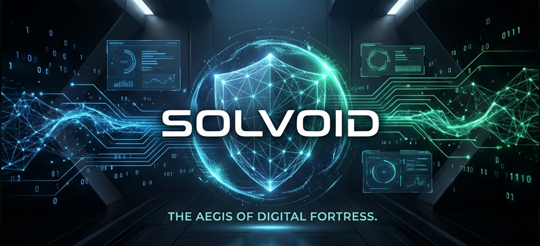

# SOLVOID | DIGITAL FORTRESS

<p align="center">
  
</p>

## The Premium Privacy Lifecycle Management (PLM) for Solana

**SolVoid** is an enterprise-grade cybersecurity platform that bridges the gap between passive privacy auditing and active cryptographic defense on the Solana blockchain.

[](https://github.com/solvoid/solvoid)
[](./LICENSE)
[](./documentation/architecture/OVERVIEW.md)

---

### 🛡️ Tactical Capabilities

#### 1. Identity Forensics (Privacy Passport)
A deep-scanning engine that performs multi-layered forensic analysis of every account and instruction in your transaction history. It detects **Identity Linkage**, **Metadata Leaks**, and **State Exposure** with surgical precision.

#### 2. Active Defense (Surgical Rescue)
A high-stakes workflow designed to identify compromised assets and neutralize threats in real-time. Move assets from high-risk public entries into the Shadow Vault with a single click.

#### 3. Shadow Vault (ZK Shielding)
A cryptographically enforced privacy protocol using **Groth16 ZK-SNARKs**. Break on-chain links between your public identity and your private assets using non-custodial shielding and anonymous relayer networks.

---

### 🚀 Quick Start

#### Installation
```bash
npm install @solvoid/sdk
```

#### Perform your first scan
```bash
npx solvoid-scan <TRANSACTION_SIGNATURE> --enterprise
```

#### Shielding an asset
```typescript
import { SolVoidClient } from '@solvoid/sdk';

const client = new SolVoidClient({ rpcUrl: process.env.RPC_URL });
const { note, signature } = await client.rescue.shieldAsset(amount, mint);
console.log(`Asset Shielded: ${signature}`);
```

---

### 📚 Documentation Hub

Explore our comprehensive technical resources:

| Section | Description |
| --- | --- |
| [**System Introduction**](./documentation/INTRO.md) | Vision, Mission, and Core Pillars. |
| [**Architecture Overview**](./documentation/architecture/OVERVIEW.md) | Deep dive into ZK circuits, program state, and scanner logic. |
| [**Getting Started Guide**](./documentation/guides/GETTING_STARTED.md) | From zero to your first tactical scan. |
| [**Shielding Workflow**](./documentation/guides/SHIELDING_WORKFLOW.md) | How to execute a successful surgical rescue operation. |
| [**CLI Reference**](./documentation/reference/CLI.md) | Comprehensive list of commands, profiles, and enterprise flags. |

---

### ☣️ Security & Trust

**SolVoid is non-custodial.** Your secrets never leave your local environment. We do not track IPs, we do not log queries, and we do not hold your keys.

- **Non-Custodial**: You are the sole owner of your ZK notes.
- **Auditable**: Our ZK circuits and on-chain programs are open-source and verified.
- **Relayer Isolation**: Anonymous relayers handle gas payments without ever seeing your signature or identity.

---

### 🤝 Contributing

We welcome contributions from protocol engineers and cryptography researchers. Please see [CONTRIBUTING.md](./CONTRIBUTING.md) for our security-first contribution guidelines.

### ⚖️ Disclaimer

*Solana is a public and permanent ledger. SolVoid is a tool to help you manage your privacy footprint; it does not provide legal protection or complete anonymity against nation-state actors. Use with professional caution.*

---
<p align="center">
  <b>TERMINAL STATUS: ONLINE | ENCRYPTION: ACTIVE | PRIVACY: ENFORCED</b>
</p>
