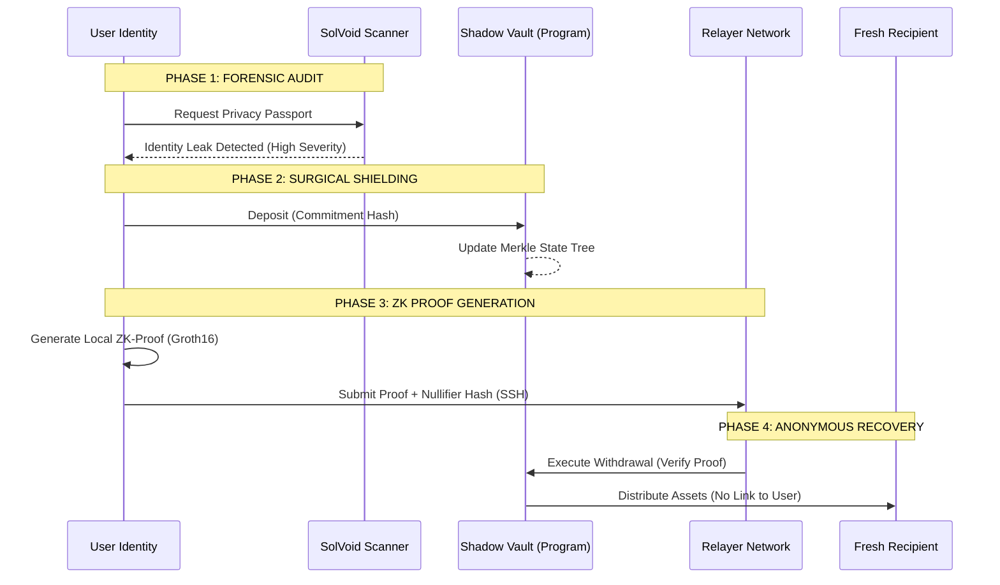

# SOLVOID | THE DIGITAL FORTRESS FOR SOLANA

[VERSION: 1.2.4-STABLE] | [LICENSE: MIT] | [SECURITY: ENFORCED]

SolVoid is a high-performance Privacy Lifecycle Management (PLM) framework engineered for the Solana blockchain. It provides an enterprise-grade suite of forensic auditing tools and cryptographically enforced shielding protocols designed to neutralize identity leaks and maintain on-chain anonymity.

---

## [I] ARCHITECTURAL PILLARS

### 1. IDENTITY FORENSICS (SOLVOID SCANNER)
The scanner utilizes a multi-layered detection engine to analyze account history. It evaluates transactions against known leakage patterns, including:
*   **Direct Linkage**: Connections to KYC-verified exchange addresses.
*   **Binary Metadata Leaks**: Public key exposure within instruction data payloads.
*   **Account Relationships**: State-level footprints in third-party program accounts.
*   **MEV Sensitivity**: Vulnerability to predatory sandwich attacks based on historical slippage tolerance.

### 2. DISCRETE SHIELDING (SHADOW VAULT)
The core privacy layer is a non-custodial vault powered by Groth16 ZK-SNARKs. 
*   **State Tree**: A 20-level incremental Merkle tree supporting an anonymity set of 1,048,575 individual deposits.
*   **Commitment Protocol**: Cryptographic binding of secret and nullifier values, ensuring assets are unlinkable once deposited.
*   **Relayer Isolation**: Support for ephemeral relayers to decouple transaction fee payment from identity.

### 3. SURGICAL RESCUE WORKFLOW
An automated pipeline that bridges auditing and defense. The Rescue workflow identifies tainted assets and executes an atomic migration into the Shadow Vault, effectively "cleansing" the history of the fund's current owner.

---

## [II] SYSTEM ARCHITECTURE

The following diagram illustrates the flow from initial identity compromise to cryptographic recovery.



---

## [III] ENTERPRISE CLI REFERENCE

The `solvoid-scan` utility is the primary management interface.

### CORE COMMANDS
| Command | Usage | Description |
| :--- | :--- | :--- |
| **PROTECT** | `protect <ADDRESS>` | Executes forensic analysis and generates a Privacy Passport. |
| **RESCUE** | `rescue <ADDRESS>` | Automated detection and shielding of all leaked assets. |
| **SHIELD** | `shield <AMOUNT>` | Manual cryptographic commitment of SOL into the Vault. |
| **WITHDRAW** | `withdraw <...>` | Executes a ZK-SNARK membership proof and withdrawal. |

### SECURITY FLAGS
*   `--shadow-rpc`: Routes all queries through encrypted relay hops to prevent IP logging.
*   `--surgical`: Limits shielding operations strictly to assets with identified leakage history.
*   `--relayer-auth`: Provides credentials for private enterprise relayer networks.

---

## [IV] INTEGRATION & SDK

SolVoid is designed for protocol developers to bake privacy into their own applications.

```typescript
import { SolVoidClient } from 'solvoid';

// Enterprise Client Configuration
const client = new SolVoidClient({
    rpcUrl: process.env.SOLANA_RPC_URL,
    programId: process.env.SOLVOID_PROGRAM_ID,
    relayerUrl: "https://relayer.internal.net",
    stealthMode: true
}, walletSigner);

// Execute a privacy-preserving rescue operation
const rescueResult = await client.rescue(targetAccount);
if (rescueResult.status === 'SUCCESS') {
    console.log(`[STATE] Assets Shielded. New Privacy Score: ${rescueResult.newScore}/100`);
}
```

---

## [V] DOCUMENTATION HUB MAP

For deep-dive technical specifications, refer to the following sub-directories:

*   **[Technical Architecture](./documentation/architecture/OVERVIEW.md)**: Deep dive into the Merkle Tree and ZK Circuits.
*   **[SDK Reference](./documentation/reference/SDK.md)**: Exhaustive documentation of classes and methods.
*   **[Relayer API](./documentation/reference/API.md)**: Specifications for building/running a relayer node.
*   **[Development Guide](./documentation/reference/DEVELOPMENT.md)**: Instructions for compiling circuits and testing.

---

## [VI] COMPLIANCE & SECURITY

*   **Non-Custodial**: SolVoid never has access to user keys or unshielded secrets.
*   **Verifiable**: All ZK circuits are open-source and deterministic.
*   **Zero-Logging**: The CLI and official Relayers utilize ephemeral states with no persistent logging of user patterns.

**[!] DISCLAIMER**: SolVoid is an advanced security tool. On-chain privacy is a competitive game; ensure you understand the underlying mathematics before deploying to high-value production environments.

---
[SYSTEM_STATUS: OPERATIONAL] | [ENCRYPTION_ENGINE: GROTH16]
