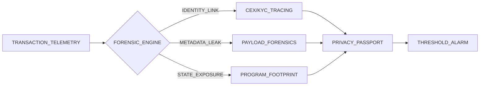
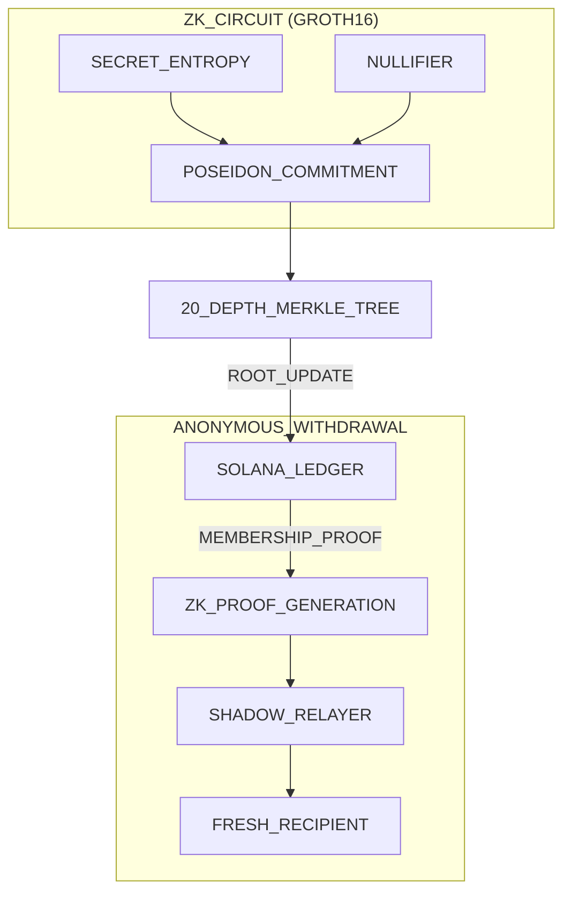

<div align="center">

# SOLVOID | TACTICAL PRIVACY INFRASTRUCTURE
### [ENTERPRISE_EDITION_V1.2.4]

---

[SYSTEM_STATUS: **ONLINE**] | [ENCRYPTION: **GROTH16_ACTIVE**] | [ANONYMITY_SET: **1,048,575**]

---

</div>

## [00] EXECUTIVE SUMMARY

SolVoid is an elite **Privacy Lifecycle Management (PLM)** platform engineered for the Solana ecosystem. It bridges the critical gap between passive auditing (vulnerability identification) and active cryptographic defense (asset shielding). Utilizing high-depth Merkle Trees and Groth16 ZK-SNARKs, SolVoid provides a "Digital Fortress" for institutional and high-net-worth on-chain identifiers.

---

## [01] PROTOCOL ARCHITECTURE

The SolVoid protocol operates as a four-stage state machine, transitioning accounts from a compromised "Public" state to a neutralized "Shielded" state.

### [A] THE FORENSIC PIPELINE
The engine performs multi-layered analysis of transaction telemetry to compute a deterministic **Privacy Score**.



### [B] THE SHADOW VAULT (ZK-SHIELDING)
Assets are decoupled from their history through a non-custodial commitment pool.



---

## [02] TECHNICAL SPECIFICATIONS

| COMPONENT | SPECIFICATION | IMPLEMENTATION |
| :--- | :--- | :--- |
| **ZK-Proof** | Groth16 | Alt-Bn128 / R1CS |
| **Hash Function** | Poseidon / Keccak-256 | High-Efficiency Circuit Logic |
| **Tree Depth** | 20 Levels | 1,048,575 Maximum Leaves |
| **History Buffer** | 30 Roots | Prevents Asynchronous Race Conditions |
| **Relay Hops** | 3 Nodes | Onion-Style Transaction Routing |
| **Audit Coverage** | 1000 TX Depth | Multi-Layer Identity Forensics |

---

## [03] CORE COMMAND INTERFACE

The `solvoid-scan` CLI is a high-density utility for privacy management.

### [ COMMAND_PROTECT ]
*   **Action**: Executes deep-scanning forensics.
*   **Usage**: `npx solvoid-scan protect <ADDRESS> --rpc <PRIVATE_URL>`
*   **Metric**: Detects Identity Linkage, Metadata Hygiene, and MEV Resilience.

### [ COMMAND_RESCUE ]
*   **Action**: Automated identify-and-shield macro.
*   **Usage**: `npx solvoid-scan rescue <ADDRESS> --surgical --shadow-rpc`
*   **Logic**: Targets only leaked assets to optimize transaction volume.

### [ COMMAND_SHIELD ]
*   **Action**: Cryptographic commitment of fixed denominations.
*   **Usage**: `npx solvoid-scan shield 1.0`
*   **Output**: Returns unique **Secret** and **Nullifier** pairs.

### [ COMMAND_WITHDRAW ]
*   **Action**: Unlinked recovery of shielded assets.
*   **Usage**: `npx solvoid-scan withdraw <SECRET> <NULLIFIER> <RECIPIENT>`

---

## [04] SDK INTEGRATION (FOR PROTOCOL ENGINEERS)

Integrate the tactical privacy engine directly into your DApp or infrastructure stack.

```typescript
import { SolVoidClient } from 'solvoid';

/**
 * [INIT] Configure Technical Signer
 */
const client = new SolVoidClient({
    rpcUrl: "https://your-node.com",
    programId: "Fg6PaFpoGXkYsidMpSsu3SWJYEHp7rQU9YSTFNDQ4F5i",
    relayerUrl: "https://relayer.solvoid.example.com",
    stealthMode: true
}, vaultSigner);

/**
 * [ACTION] Execute Multi-Layer Forensics
 */
const results = await client.protect(targetPublicKey);
console.log(`[STATE] Score: ${results.avgScore} | Health: ${results.badgeStr}`);

/**
 * [ACTION] Perform Surgical Shielding
 */
const { txid, commitmentData } = await client.shield(10.0 * 1e9);
// commitmentData.secret -> Store in Secure Vault
```

---

## [05] THE SHADOW RELAYER NETWORK

To maintain IP anonymity, SolVoid utilizes an specialized Relayer API.

*   **Endpoint**: `POST /relay-withdraw` -> Accepts ZK-Proof payloads.
*   **Endpoint**: `GET /commitments` -> Fetches Merkle state for local Proving.
*   **Architecture**: Relayers take a protocol-defined bounty to pay for Solana gas, severing the fee-payer relationship.

---

## [06] DOCUMENTATION HUB MAP

| MODULE | DESCRIPTION | REFERENCE |
| :--- | :--- | :--- |
| **Architecture** | Deep-dive into ZK Circuits and Program State. | [VIEW_OVERVIEW](./documentation/architecture/OVERVIEW.md) |
| **Core_SDK** | Full Method and Type Registry for Developers. | [VIEW_SDK_REF](./documentation/reference/SDK.md) |
| **Relayer_API** | Specifications for JSON-RPC implementation. | [VIEW_API_REF](./documentation/reference/API.md) |
| **CLI_Guide** | Advanced flags and Enterprise workflows. | [VIEW_CLI_REF](./documentation/reference/CLI.md) |
| **Onboarding** | Tactical guide from installation to recovery. | [VIEW_START_GUIDE](./documentation/guides/GETTING_STARTED.md) |

---

## [07] COMPLIANCE & SECURITY STANDARDS

*   **NON-CUSTODIAL**: All cryptographic secrets are generated and stored locally.
*   **AUDIT_READY**: Circuits are deterministic; verification keys match public R1CS.
*   **NO_IP_LOGGING**: Stealth-mode RPC queries prevent transaction-to-IP correlation.

---

<div align="center">

**[ TERMINAL_STATUS: SECURE ]**
**[ PROPERTY_OF: SOLVOID_PROTOCOL_MAINTAINERS ]**

</div>
