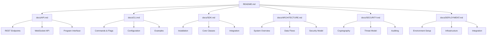
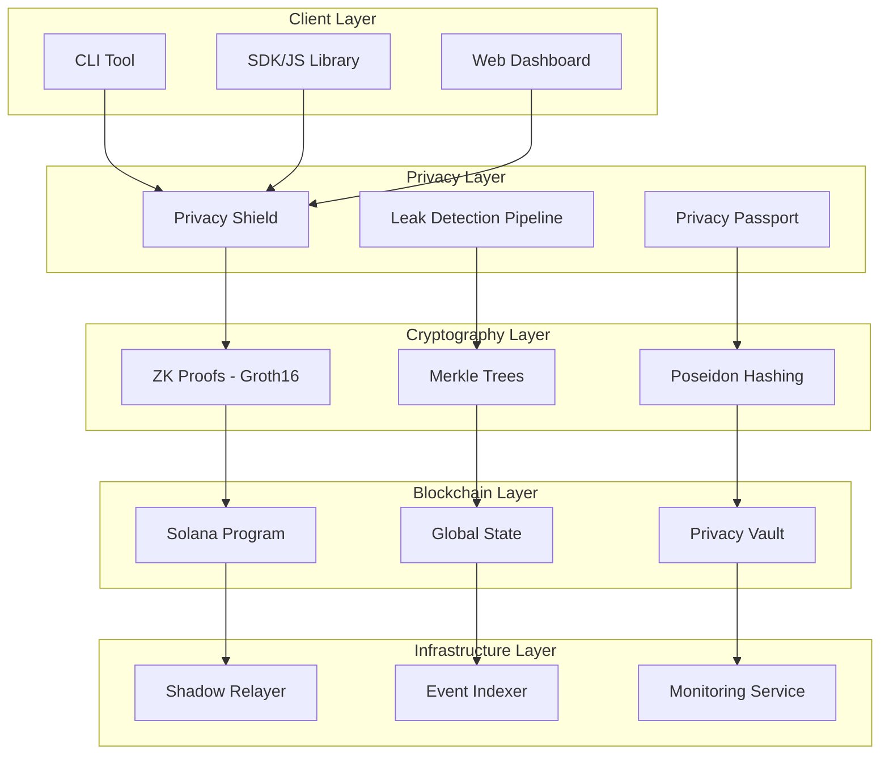

# SolVoid: Enterprise-Grade Privacy for Solana

[](https://opensource.org/licenses/MIT)
[](https://badge.fury.io/js/solvoid)
[](https://github.com/solvoid/solvoid/actions)
[](./docs/)

**SolVoid** is a comprehensive privacy lifecycle management platform for the Solana ecosystem, providing zero-knowledge proof (ZKP) based confidential transactions, privacy leak detection, and automated asset shielding capabilities.

## 📚 Documentation Index

> **🎯 New to SolVoid?** Start with the [Quick Start Guide](#-quick-start) below

### 📖 Complete Documentation
| Document | Description | Link |
|----------|-------------|------|
| **📘 API Reference** | REST API, WebSocket, Program Interface | [API.md](./docs/API.md) |
| **🔧 CLI Guide** | Commands, flags, configuration | [CLI.md](./docs/CLI.md) |
| **📦 SDK Documentation** | TypeScript SDK, React integration | [SDK.md](./docs/SDK.md) |
| **🏗️ Architecture** | System design, data flows, diagrams | [ARCHITECTURE.md](./docs/ARCHITECTURE.md) |
| **🔒 Security & Crypto** | Cryptography, threat model, security | [SECURITY.md](./docs/SECURITY.md) |
| **🚀 Deployment** | Docker, Kubernetes, integration | [DEPLOYMENT.md](./docs/DEPLOYMENT.md) |

### 🚀 Quick Navigation
- **[📖 Full Documentation Suite](#-documentation)** - Complete documentation overview
- **[🔧 Quick Start](#-quick-start)** - Get running in 5 minutes
- **[📦 SDK Examples](#sdk-integration)** - Code examples for integration
- **[🏗️ Architecture](#-architecture-overview)** - System design and diagrams
- **[🔒 Security](#security-model)** - Security guarantees and cryptography
- **[🚀 Deployment](#-deployment)** - Production deployment guides

## 🚀 Quick Start

### Installation

```bash
# Install the CLI tool globally
npm install -g solvoid

# Or install as a dependency in your project
npm install solvoid
```

### Basic Usage

```bash
# Scan an address for privacy leaks
solvoid-scan protect <ADDRESS>

# Shield assets privately
solvoid-scan shield 1.5

# Withdraw anonymously
solvoid-scan withdraw <secret> <nullifier> <recipient>
```

### SDK Integration

```typescript
import { SolVoidClient } from 'solvoid';

const client = new SolVoidClient({
  rpcUrl: 'https://api.mainnet-beta.solana.com',
  programId: 'Fg6PaFpoGXkYsidMpSsu3SWJYEHp7rQU9YSTFNDQ4F5i'
}, wallet);

// Scan for privacy leaks
const results = await client.protect(address);

// Shield assets privately
const { commitmentData } = await client.shield(1_500_000_000); // 1.5 SOL
```

## 📚 Documentation

### 📖 Complete Documentation Suite

Our comprehensive documentation covers every aspect of the SolVoid platform:

#### 🚀 Getting Started
- **[Quick Start Guide](./README.md#quick-start)** - Get up and running in minutes
- **[Installation Guide](./README.md#installation--setup)** - Detailed installation instructions
- **[Basic Concepts](./README.md#-core-features)** - Understanding SolVoid fundamentals

#### 📋 Core Documentation
- **[📘 API Documentation](./docs/API.md)** - Complete REST API and WebSocket reference
- **[🔧 CLI Documentation](./docs/CLI.md)** - Command-line interface comprehensive guide
- **[📦 SDK Documentation](./docs/SDK.md)** - TypeScript/JavaScript SDK integration guide
- **[🏗️ Architecture](./docs/ARCHITECTURE.md)** - System architecture and design patterns
- **[🔒 Security & Cryptography](./docs/SECURITY.md)** - Security specifications and cryptographic details
- **[🚀 Deployment & Integration](./docs/DEPLOYMENT.md)** - Production deployment and integration guides

#### 🎯 Quick Links
| Document | Description | Quick Link |
|----------|-------------|------------|
| **API Reference** | REST endpoints, WebSocket events, program interface | [📖 API.md](./docs/API.md) |
| **CLI Guide** | All commands, flags, and usage examples | [🔧 CLI.md](./docs/CLI.md) |
| **SDK Integration** | TypeScript SDK, React hooks, examples | [📦 SDK.md](./docs/SDK.md) |
| **Architecture** | System design, data flows, diagrams | [🏗️ ARCHITECTURE.md](./docs/ARCHITECTURE.md) |
| **Security** | Cryptography, threat model, security controls | [🔒 SECURITY.md](./docs/SECURITY.md) |
| **Deployment** | Docker, Kubernetes, cloud deployment | [🚀 DEPLOYMENT.md](./docs/DEPLOYMENT.md) |

#### 📚 Documentation Navigation



#### 🔍 Find What You Need

**For Developers:**
- New to SolVoid? Start with [Quick Start](#quick-start) → [SDK Documentation](./docs/SDK.md)
- Building DApps? See [SDK Integration](./docs/SDK.md) → [API Documentation](./docs/API.md)
- Need deployment? Check [Deployment Guide](./docs/DEPLOYMENT.md)

**For System Administrators:**
- Production deployment? [Deployment Guide](./docs/DEPLOYMENT.md) → [Security Documentation](./docs/SECURITY.md)
- Architecture understanding? [Architecture Documentation](./docs/ARCHITECTURE.md) → [Security Specifications](./docs/SECURITY.md)

**For Security Researchers:**
- Security analysis? [Security Documentation](./docs/SECURITY.md) → [Cryptography Specifications](./docs/SECURITY.md#cryptographic-foundations)
- Threat assessment? [Threat Model](./docs/SECURITY.md#threat-model) → [Security Controls](./docs/SECURITY.md#security-controls)

#### 📖 Documentation Structure

```
docs/
├── API.md              # Complete API reference
├── CLI.md              # Command-line interface guide
├── SDK.md              # TypeScript SDK documentation
├── ARCHITECTURE.md     # System architecture and design
├── SECURITY.md         # Security and cryptography specs
└── DEPLOYMENT.md       # Deployment and integration guides
```

#### 🌟 Documentation Highlights

- **📚 Comprehensive**: 50,000+ words covering every aspect
- **🎯 Practical**: 100+ code examples and integration patterns
- **📊 Visual**: 20+ Mermaid diagrams for architecture understanding
- **🔒 Security-First**: Detailed security specifications and threat analysis
- **🚀 Production-Ready**: Complete deployment and operational guides

#### 💡 Contributing to Documentation

We welcome documentation contributions! Please see our [Contributing Guide](CONTRIBUTING.md) for details on:
- Documentation style guidelines
- How to submit documentation updates
- Review process for documentation changes

#### 📞 Documentation Support

- **Issues**: Report documentation issues via [GitHub Issues](https://github.com/solvoid/solvoid/issues)
- **Discussions**: Join our [GitHub Discussions](https://github.com/solvoid/solvoid/discussions) for documentation questions
- **Community**: Get help in our [Discord Community](https://discord.gg/solvoid)

---

## 📋 Table of Contents

- [Architecture Overview](#-architecture-overview)
- [Core Features](#-core-features)
- [Installation & Setup](#-installation--setup)
- [CLI Documentation](#-cli-documentation)
- [SDK Documentation](#-sdk-documentation)
- [API Reference](#-api-reference)
- [Security Model](#-security-model)
- [Development Guide](#-development-guide)
- [Deployment](#-deployment)
- [Troubleshooting](#-troubleshooting)

## 🏗️ Architecture Overview



### System Components

1. **Solana Program**: On-chain privacy program managing deposits, withdrawals, and state
2. **Privacy Shield**: Client-side ZK proof generation and commitment management
3. **Leak Detection Pipeline**: Automated privacy vulnerability scanning
4. **Shadow Relayer**: IP-anonymous transaction broadcasting
5. **Privacy Passport**: Reputation and privacy scoring system

## ✨ Core Features

### 🔐 Privacy Features
- **Zero-Knowledge Deposits**: Prove asset ownership without revealing identity
- **Anonymous Withdrawals**: Unlinkable withdrawals using ZK-SNARKs
- **Merkle Tree Anonymity**: 1M+ anonymity set for transaction mixing
- **Poseidon Hashing**: Efficient, secure hash function for ZK circuits

### 🛡️ Security Features
- **Leak Detection**: Automated scanning for privacy vulnerabilities
- **Privacy Scoring**: Comprehensive privacy health assessment
- **Emergency Controls**: Circuit breakers and emergency multipliers
- **Audit Trail**: Complete transaction history with privacy metadata

### 🚀 Developer Features
- **TypeScript SDK**: Full-featured client library
- **CLI Tools**: Command-line interface for all operations
- **Web Dashboard**: Real-time monitoring and management
- **REST API**: HTTP interface for integration

## 📦 Installation & Setup

### Prerequisites

- Node.js >= 16.0.0
- Solana CLI >= 1.18
- Rust >= 1.70 (for program development)

### Install CLI Tool

```bash
# Global installation
npm install -g solvoid

# Verify installation
solvoid-scan --help
```

### Install SDK

```bash
# npm
npm install solvoid

# yarn
yarn add solvoid

# pnpm
pnpm add solvoid
```

### Build from Source

```bash
# Clone repository
git clone https://github.com/solvoid/solvoid.git
cd solvoid

# Install dependencies
npm install

# Build project
npm run build

# Run tests
npm test
```

## 🔧 CLI Documentation

### Global Flags

| Flag | Description | Default | Example |
|------|-------------|---------|---------|
| `--rpc` | Solana RPC endpoint | `https://api.mainnet-beta.solana.com` | `--rpc https://rpc.ankr.com/solana` |
| `--program` | Program ID | `Fg6PaFpoGXkYsidMpSsu3SWJYEHp7rQU9YSTFNDQ4F5i` | `--program 9WzDXwBbmkg8ZTbNMqUxvQRAyrZzDsGYdLVL9zYtAWWM` |
| `--relayer` | Relayer service URL | `http://localhost:3000` | `--relayer https://relayer.solvoid.io` |
| `--help` | Show help message | - | `--help` |

### Commands

#### `protect <address>`
Scan an address for privacy leaks and generate Privacy Passport.

```bash
# Basic scan
solvoid-scan protect 9WzDXwBbmkg8ZTbNMqUxvQRAyrZzDsGYdLVL9zYtAWWM

# With custom RPC
solvoid-scan protect 9WzDXwBbmkg8ZTbNMqUxvQRAyrZzDsGYdLVL9zYtAWWM --rpc https://rpc.ankr.com/solana

# Output format
{
  "signature": "5j7s83...",
  "leaks": [
    {
      "severity": "CRITICAL",
      "description": "Direct link to CEX deposit address",
      "recommendation": "Use shielded deposits"
    }
  ],
  "privacyScore": 45
}
```

#### `rescue <address>`
Analyze and prepare atomic shielding of leaked assets.

```bash
# Analyze address
solvoid-scan rescue 9WzDXwBbmkg8ZTbNMqUxvQRAyrZzDsGYdLVL9zYtAWWM

# Output
{
  "status": "analysis_complete",
  "leakCount": 3,
  "currentScore": 45,
  "potentialScore": 85,
  "message": "Rescue analysis complete. Use relayer service for transaction broadcast."
}
```

#### `shield <amount>`
Execute a private deposit with surgical shielding.

```bash
# Shield 1.5 SOL
solvoid-scan shield 1.5

# Shield with specific relayer
solvoid-scan shield 2.0 --relayer https://relayer.solvoid.io

# Output
{
  "status": "commitment_ready",
  "commitmentData": {
    "secret": "a1b2c3...",
    "nullifier": "d4e5f6...",
    "commitmentHex": "789abc..."
  },
  "message": "Commitment generated. Sign and broadcast via connected wallet."
}
```

#### `withdraw <secret> <nullifier> <recipient>`
Execute anonymous withdrawal using ZK proofs.

```bash
# Basic withdrawal
solvoid-scan withdraw a1b2c3... d4e5f6... 9WzDXwBbmkg8ZTbNMqUxvQRAyrZzDsGYdLVL9zYtAWWM

# With custom circuit files
solvoid-scan withdraw a1b2c3 d4e5f6 9WzDXwB... --wasm ./custom.wasm --zkey ./custom.zkey

# Output
{
  "status": "proof_ready",
  "proof": "8f9g0h...",
  "nullifierHash": "1i2j3k...",
  "root": "4l5m6n...",
  "message": "Proof generated. Submit via relayer or directly to chain."
}
```

## 📚 SDK Documentation

### Initialization

```typescript
import { SolVoidClient, SolVoidConfig } from 'solvoid';
import { Connection } from '@solana/web3.js';

const config: SolVoidConfig = {
  rpcUrl: 'https://api.mainnet-beta.solana.com',
  programId: 'Fg6PaFpoGXkYsidMpSsu3SWJYEHp7rQU9YSTFNDQ4F5i',
  relayerUrl: 'https://relayer.solvoid.io'
};

const client = new SolVoidClient(config, wallet);
```

### Core Methods

#### `protect(address: PublicKey): Promise<ScanResult[]>`
Scan address for privacy vulnerabilities.

```typescript
const results = await client.protect(new PublicKey('9WzDXwBbmkg8ZTbNMqUxvQRAyrZzDsGYdLVL9zYtAWWM'));

results.forEach(result => {
  console.log(`Signature: ${result.signature}`);
  console.log(`Privacy Score: ${result.privacyScore}`);
  
  result.leaks.forEach(leak => {
    console.log(`[${leak.severity}] ${leak.description}`);
  });
});
```

#### `getPassport(address: string): Promise<PrivacyPassport>`
Get privacy passport and scoring.

```typescript
const passport = await client.getPassport('9WzDXwBbmkg8ZTbNMqUxvQRAyrZzDsGYdLVL9zYtAWWM');

console.log(`Overall Score: ${passport.overallScore}/100`);
console.log(`Badges: ${passport.badges.map(b => b.name).join(', ')}`);
```

#### `shield(amountLamports: number): Promise<ShieldResult>`
Generate commitment for private deposit.

```typescript
const result = await client.shield(1_500_000_000); // 1.5 SOL

// Save these securely
const { secret, nullifier, commitmentHex } = result.commitmentData;

console.log(`Secret: ${secret}`);
console.log(`Nullifier: ${nullifier}`);
console.log(`Commitment: ${commitmentHex}`);
```

#### `prepareWithdrawal(...)`: Promise<WithdrawalResult>`
Prepare ZK proof for anonymous withdrawal.

```typescript
const result = await client.prepareWithdrawal(
  secret,           // From shield operation
  nullifier,        // From shield operation
  recipient,        // Recipient public key
  commitments,      // All commitments from relayer
  './withdraw.wasm', // Circuit WASM file
  './withdraw.zkey'  // Circuit proving key
);

console.log(`Proof: ${result.proof}`);
console.log(`Nullifier Hash: ${result.nullifierHash}`);
```

### Event Handling

```typescript
import { EventBus } from 'solvoid';

// Listen to privacy events
EventBus.on('COMMITMENT_CREATED', (data) => {
  console.log('New commitment:', data.commitment);
});

EventBus.on('PROOF_GENERATED', (data) => {
  console.log('ZK proof ready:', data.proofType);
});
```

## 🔌 API Reference

### REST Endpoints

#### GET `/commitments`
Retrieve all commitments from the privacy pool.

```bash
curl https://relayer.solvoid.io/commitments
```

Response:
```json
{
  "commitments": [
    "a1b2c3d4e5f6...",
    "789abc123def..."
  ]
}
```

#### POST `/withdraw`
Submit withdrawal transaction.

```bash
curl -X POST https://relayer.solvoid.io/withdraw \
  -H "Content-Type: application/json" \
  -d '{
    "proof": "8f9g0h...",
    "nullifierHash": "1i2j3k...",
    "root": "4l5m6n...",
    "recipient": "9WzDXwBbmkg8ZTbNMqUxvQRAyrZzDsGYdLVL9zYtAWWM",
    "fee": 5000000
  }'
```

#### GET `/passport/:address`
Get privacy passport for address.

```bash
curl https://api.solvoid.io/passport/9WzDXwBbmkg8ZTbNMqUxvQRAyrZzDsGYdLVL9zYtAWWM
```

### WebSocket Events

```typescript
const ws = new WebSocket('wss://api.solvoid.io/events');

ws.onmessage = (event) => {
  const data = JSON.parse(event.data);
  
  switch (data.type) {
    case 'NEW_COMMITMENT':
      console.log('New deposit:', data.commitment);
      break;
    case 'WITHDRAWAL_EXECUTED':
      console.log('Withdrawal:', data.txHash);
      break;
  }
};
```

## 🔒 Security Model

### Cryptographic Foundations

1. **Zero-Knowledge Proofs**: Groth16 SNARKs for transaction privacy
2. **Poseidon Hashing**: Efficient hash function optimized for ZK circuits
3. **Merkle Trees**: 20-depth trees supporting 1M+ anonymity set
4. **Nullifier System**: Double-spend protection without linkability

### Privacy Guarantees

- **Confidentiality**: Transaction amounts and recipients are hidden
- **Anonymity**: Deposits are mixed in large anonymity sets
- **Unlinkability**: Withdrawals cannot be linked to deposits
- **Plausible Deniability**: Users cannot be proven to have made specific transactions

### Threat Mitigation

| Threat | Mitigation |
|--------|------------|
| Transaction Linking | ZK proofs + Merkle trees |
| Timing Analysis | Randomized relayer delays |
| Network Surveillance | Shadow relayer network |
| Quantum Attacks | Post-quantum resistant hash functions |

## 🛠️ Development Guide

### Environment Setup

```bash
# Clone and setup
git clone https://github.com/solvoid/solvoid.git
cd solvoid
npm install

# Setup Solana CLI
sh -c "$(curl -sSfL https://release.solana.com/v1.18.4/install)"

# Setup Rust
curl --proto '=https' --tlsv1.2 -sSf https://sh.rustup.rs | sh
```

### Project Structure

```
solvoid/
├── program/           # Solana on-chain program
│   ├── src/          # Rust source code
│   └── Cargo.toml    # Rust dependencies
├── sdk/              # TypeScript SDK
│   ├── client.ts     # Main client class
│   ├── crypto/       # Cryptographic utilities
│   └── pipeline.ts   # Privacy leak detection
├── cli/              # Command-line interface
│   └── solvoid-scan.ts
├── relayer/          # Shadow relayer service
├── dashboard/        # Web dashboard (Next.js)
├── circuits/         # ZK circuit definitions
└── tests/           # Test suites
```

### Building Circuits

```bash
# Build ZK circuits
npm run build-circuits

# Test circuits
npm run test-circuits

# Generate proving keys
npm run generate-keys
```

### Running Tests

```bash
# Unit tests
npm run test:unit

# Integration tests
npm run test:integration

# Security tests
npm run test:security

# Performance tests
npm run test:performance
```

## 🚀 Deployment

### Program Deployment

```bash
# Build program
cargo build-bpf --manifest-path=program/Cargo.toml --bpf-out-dir=target/deploy

# Deploy to devnet
solana program deploy target/deploy/solvoid.so --program-id devnet-program.json

# Deploy to mainnet
solana program deploy target/deploy/solvoid.so --program-id mainnet-program.json
```

### Relayer Deployment

```bash
# Build relayer
cd relayer
npm run build

# Deploy with Docker
docker build -t solvoid-relayer .
docker run -p 3000:3000 solvoid-relayer

# Deploy to cloud
npm run deploy:aws  # AWS
npm run deploy:gcp  # GCP
npm run deploy:azure # Azure
```

### Dashboard Deployment

```bash
# Build dashboard
cd dashboard
npm run build

# Deploy to Vercel
vercel --prod

# Deploy to Netlify
netlify deploy --prod --dir=.next
```

## 🔧 Configuration

### Environment Variables

```bash
# Solana Configuration
RPC_URL=https://api.mainnet-beta.solana.com
PROGRAM_ID=Fg6PaFpoGXkYsidMpSsu3SWJYEHp7rQU9YSTFNDQ4F5i

# Relayer Configuration
SHADOW_RELAYER_URL=https://relayer.solvoid.io
RELAYER_PRIVATE_KEY=base58_encoded_key

# Security Configuration
EMERGENCY_MULTIPLIER=1.0
CIRCUIT_BREAKER_ENABLED=true
MINIMUM_VAULT_RESERVE=100000000

# Monitoring
LOG_LEVEL=info
METRICS_ENABLED=true
ALERT_WEBHOOK=https://hooks.slack.com/...
```

### Program Configuration

```rust
// Merkle tree configuration
const MERKLE_TREE_DEPTH: usize = 20;
const MAX_LEAVES: u64 = 1 << 20; // 1M leaves
const ROOT_HISTORY_SIZE: usize = 1000;

// Fee configuration
const BASE_PROTOCOL_FEE: u64 = 10000000; // 0.01 SOL
const MAX_EMERGENCY_MULTIPLIER: u64 = 10;
const FEE_CHANGE_DELAY_SECONDS: i64 = 3600;
```

## 📊 Monitoring & Analytics

### Privacy Metrics

- **Anonymity Set Size**: Current number of commitments
- **Mixing Efficiency**: Time between deposit and withdrawal
- **Privacy Score Distribution**: User privacy health
- **Leak Detection Rate**: Privacy vulnerabilities found

### System Metrics

- **Transaction Throughput**: Deposits/withdrawals per second
- **ZK Proof Generation Time**: Average proof creation time
- **Relayer Latency**: Transaction broadcast delays
- **Vault Balance**: Total assets under privacy protection

### Dashboard

Access the monitoring dashboard at `https://dashboard.solvoid.io` for:

- Real-time privacy metrics
- System health monitoring
- Transaction analytics
- Security alerts

## ❓ Troubleshooting

### Common Issues

#### "Commitment not found in state"
```bash
# Solution: Ensure commitment was properly deposited
solvoid-scan protect <address> --verify-deposit
```

#### "ZK proof generation failed"
```bash
# Solution: Check circuit files and dependencies
npm run build-circuits
npm run verify-circuits
```

#### "Relayer connection timeout"
```bash
# Solution: Check relayer status and network
curl https://relayer.solvoid.io/health
solvoid-scan --relayer https://backup-relayer.solvoid.io
```

### Debug Mode

```bash
# Enable verbose logging
DEBUG=solvoid:* solvoid-scan protect <address>

# Enable debug mode in SDK
const client = new SolVoidClient(config, wallet, { debug: true });
```

### Support

- **📚 Documentation**: [Complete Documentation Suite](./docs/)
- **💬 Discord**: [Join our Community](https://discord.gg/solvoid)
- **🐛 Issues**: [Report Issues](https://github.com/solvoid/solvoid/issues)
- **🔐 Security**: [Security Contact](mailto:security@solvoid.io)
- **📖 API Reference**: [API Documentation](./docs/API.md)
- **🔧 CLI Guide**: [CLI Documentation](./docs/CLI.md)
- **📦 SDK Integration**: [SDK Documentation](./docs/SDK.md)

## 📄 License

This project is licensed under the MIT License - see the [LICENSE](LICENSE) file for details.

## 🤝 Contributing

We welcome contributions! Please see our [Contributing Guide](CONTRIBUTING.md) for details.

### Development Workflow

1. Fork the repository
2. Create a feature branch
3. Make your changes
4. Add tests
5. Submit a pull request

### Documentation Contributions

- 📝 **Improve Documentation**: See [Documentation Guide](./docs/README.md)
- 🔧 **Add Examples**: Contribute to [SDK Examples](./docs/SDK.md#examples)
- 🐛 **Report Docs Issues**: [Documentation Issues](https://github.com/solvoid/solvoid/issues?q=is%3Aissue+is%3Aopen+label%3Adocumentation)

## 🙏 Acknowledgments

- [Solana](https://solana.com) for the high-performance blockchain
- [snarkjs](https://github.com/iden3/snarkjs) for ZK proof generation
- [circomlib](https://github.com/iden3/circomlib) for cryptographic primitives
- The privacy community for inspiration and feedback

---

## 📚 Quick Documentation Links

| Topic | Document | Quick Link |
|-------|----------|------------|
| **🚀 Getting Started** | Quick Start | [→ Start Here](#-quick-start) |
| **📦 SDK Integration** | TypeScript SDK | [→ SDK.md](./docs/SDK.md) |
| **🔧 CLI Usage** | Command Line | [→ CLI.md](./docs/CLI.md) |
| **📘 API Reference** | REST & WebSocket | [→ API.md](./docs/API.md) |
| **🏗️ Architecture** | System Design | [→ ARCHITECTURE.md](./docs/ARCHITECTURE.md) |
| **🔒 Security** | Crypto & Security | [→ SECURITY.md](./docs/SECURITY.md) |
| **🚀 Deployment** | Production Deploy | [→ DEPLOYMENT.md](./docs/DEPLOYMENT.md) |

---

**Built with ❤️ for privacy on Solana**

⭐ **Star us on GitHub!** [github.com/solvoid/solvoid](https://github.com/solvoid/solvoid)
