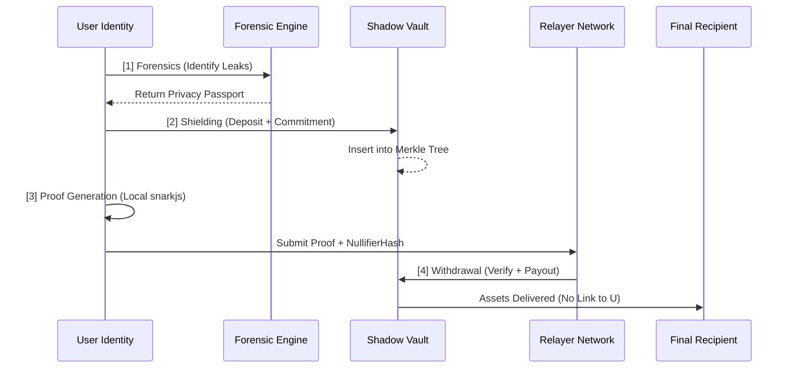

<div align="center">

# SOLVOID | THE DIGITAL FORTRESS FOR SOLANA
### [ARCHITECTURE] | [SPECIFICATIONS] | [INTEGRATION]
#### [VERSION: 1.2.4-STABLE] | [SECURITY: ENFORCED]

---

[STATUS: **OPERATIONAL**] | [ENCRYPTION: **GROTH16_ACTIVE**] | [ANONYMITY_SET: **1,048,575**] | [ACCESS: **PUBLIC**]

---

</div>

## [00] INTRODUCTION: PRIVACY LIFECYCLE MANAGEMENT (PLM)

SolVoid is an elite, enterprise-grade Privacy Lifecycle Management (PLM) framework engineered specifically for the Solana ecosystem. It establishes a critical bridge between passive auditing (vulnerability identification) and active cryptographic defense (non-custodial asset shielding).

In a transparent blockchain environment, every transaction serves as a data point for MEV bots, forensic analytics firms, and malicious actors. SolVoid provides the necessary infrastructure for entities to regain control over their on-chain identity and financial privacy through cryptographically enforced anonymity.

### CORE MISSION
*   **Auditability**: Identify where and how your identity is leaking.
*   **Neutralization**: Move tainted assets into the Shadow Vault using ZK-SNARKs.
*   **Recovery**: Execute unlinkable withdrawals to fresh identifiers.

---

## [01] TECHNICAL ARCHITECTURE & CRYPTOGRAPHY

The SolVoid protocol is built on a foundation of zero-knowledge proofs and high-depth Merkle state trees.

### 1.1 CRYPTOGRAPHIC PRIMITIVES
| PARAMETER | SPECIFICATION | RATIONALE |
| :--- | :--- | :--- |
| **Proof System** | Groth16 ZK-SNARK | Optimal verification speed and minimal proof size (131 bytes). |
| **Elliptic Curve** | BN128 (Alt-Bn128) | High compatibility with on-chain verification hardware. |
| **Hash Function** | Poseidon / Keccak-256 | High-efficiency computation within ZK circuits. |
| **Commitment** | `Poseidon(Secret, Nullifier)` | Unlinkable asset representation. |

### 1.2 PROTOCOL FLOW: THE 4-PHASE CYCLE
The transition from a public, compromised identifier to a private, secure one follows a strict state machine:



---

## [02] FORENSIC ENGINE: THE PRIVACY PASSPORT

The SolVoid Scanner performs multi-layered telemetry analysis to identify identity provenance and data leaks.

### 2.1 DETECTION LAYERS
*   **Layer 1: Identity Linkage**: Tracing provenance from CEX/KYC'd wallets to the current identifier.
*   **Layer 2: Metadata Hygiene**: Detecting serialized public keys or sensitive IDs in instruction data payloads.
*   **Layer 3: State Exposure**: Identifying footprints in third-party program accounts (e.g., ATA creation, Lending records).
*   **Layer 4: MEV Resilience**: Analyzing vulnerability to predatory mempool agents based on transaction frequency and slippage.

### 2.2 SCORING ALGORITHM
The **Privacy Score** is a weighted metric (0-100) calculated as:
`S = 100 - Σ(Leak_Penalty * Multiplier)`

| SEVERITY | PENALTY | EXAMPLES |
| :--- | :--- | :--- |
| **CRITICAL** | -40 | Direct link to CEX, Raw Pubkey in payload. |
| **HIGH** | -25 | Funding from Doxxed wallet, State exposure. |
| **MEDIUM** | -15 | Metadata hygiene issues, fingerprinting. |
| **LOW** | -5 | RPC-level exposure, non-stealth broadcasting. |

---

## [03] GETTING STARTED GUIDE

### 3.1 INSTALLATION
```bash
npm install solvoid
```

### 3.2 ENVIRONMENT CONFIGURATION
Create a `.env` file in your project root to define operational parameters:
```env
# Solana RPC Endpoint (Recommend Helius/Alchemy)
SOLANA_RPC_URL=https://api.mainnet-beta.solana.com

# Shadow Vault Program Address
SOLVOID_PROGRAM_ID=Fg6PaFpoGXkYsidMpSsu3SWJYEHp7rQU9YSTFNDQ4F5i

# Relayer Service URL for ZK Submit
SHADOW_RELAYER_URL=http://localhost:3000

# Circuits paths
ZK_WASM_PATH=./build/withdraw.wasm
ZK_ZKEY_PATH=./build/withdraw_final.zkey
```

### 3.3 INITIAL ONBOARDING FLOW
1.  **Audit**: `npx solvoid-scan protect <ADDRESS>`
2.  **Shield**: `npx solvoid-scan shield 1.0`
3.  **Withdraw**: `npx solvoid-scan withdraw <SECRET> <NULLIFIER> <RECIPIENT>`

---

## [04] COMMAND LINE INTERFACE (CLI) REFERENCE

The `solvoid-scan` utility is a high-performance terminal interface for privacy management.

### COMMANDS
*   `protect <ADDRESS>`: 
    *   Generates a full Privacy Passport.
    *   Scans last 1000 transactions.
*   `rescue <ADDRESS>`:
    *   **Surgical Rescue**: Identify and shield leaked assets automatically.
    *   Flags: `--surgical`, `--shadow-rpc`.
*   `shield <AMOUNT>`:
    *   Deposit assets and generate commitments.
    *   Output: `SECRET` and `NULLIFIER` (Backup Required).
*   `withdraw <SEC> <NULL> <REC>`:
    *   Unlinkable recovery via ZK-SNARK.

### GLOBAL FLAGS
| FLAG | DESCRIPTION | DEFAULT |
| :--- | :--- | :--- |
| `--rpc` | Custom Solana RPC URL. | Mainnet Beta |
| `--relayer` | Custom Relayer API URL. | localhost:3000 |
| `--shadow-rpc`| Encrypted multi-hop broadcasting. | FALSE |
| `--mock` | Test mode (No real SOL used). | FALSE |

---

## [05] SDK INTEGRATION GUIDE

The SolVoid SDK allows developers to integrate privacy features directly into their protocols.

### 5.1 INITIALIZATION
```typescript
import { SolVoidClient } from 'solvoid';
import { Keypair } from '@solana/web3.js';

const client = new SolVoidClient({
    rpcUrl: process.env.SOLANA_RPC_URL,
    programId: "Fg6PaFpoGXkYsidMpSsu3SWJYEHp7rQU9YSTFNDQ4F5i",
    relayerUrl: "https://relayer.solvoid.io"
}, walletSigner);
```

### 5.2 KEY SDK METHODS
| METHOD | DESCRIPTION | RETURN TYPE |
| :--- | :--- | :--- |
| `protect(address)` | Analyze hardware leaks and scores. | `Promise<LeakResult[]>` |
| `getPassport(address)`| Retrieve health records and badges. | `Promise<Passport>` |
| `rescue(address)` | Execute identified leak shielding. | `Promise<RescueResult>` |
| `shield(amount)` | Direct vault deposit. | `Promise<ShieldResult>` |
| `withdraw(params )` | ZK-membership proof withdrawal. | `Promise<WithdrawResult>` |

---

## [06] RELAYER API SPECIFICATION

The Relayer facilitates anonymous interactions by abstracting IP addresses and gas.

### ENDPOINTS
*   **GET `/commitments`**: 
    *   Returns the full state of the Merkle Tree.
    *   Used for local path construction.
*   **POST `/relay-withdraw`**: 
    *   Submits Proof + Public Signals.
    *   Relayer pays gas and takes a small bounty.
*   **POST `/webhook`**: 
    *   Real-time Geyser ingestion for tree sync.

---

## [07] DEVELOPMENT & DEPLOYMENT

### 7.1 CIRCUIT COMPILATION
Build the ZK circuits locally for custom deployments:
```bash
./scripts/build-zk.sh
```
*   **Requires**: `circom` 2.x and `snarkjs` installed globally.

### 7.2 PROGRAM DEPLOYMENT (ANCHOR)
```bash
cd program
cargo build-sbf
solana program deploy ./target/deploy/solvoid.so
```

### 7.3 TEST SUITES
```bash
# SDK Logic and Privacy Engine
npm test

# On-Chain Merkle Tree State
cd program && cargo test
```

---

## [08] SHIELDING WORKFLOW & DENOMINATION

To maximize the **Anonymity Set**, SolVoid uses a Fixed-Denomination Architecture.

| DENOMINATION | ANONYMITY FACTOR | RECOMMENDED USE |
| :--- | :--- | :--- |
| **0.1 SOL** | 1.0x | Micro-testing |
| **1.0 SOL** | 2.5x | Standard Retail |
| **10.0 SOL** | 5.0x | High-Net-Worth/Institutional |
| **100.0 SOL** | 10.0x | Strategic Reserve |

---

## [09] SECURITY & COMPLIANCE

*   **100% Non-Custodial**: Secrets are never transmitted to the blockchain or Relayer.
*   **Zero-Logging Architecture**: CLI and Relayer use ephemeral states to prevent pattern matching.
*   **Deterministic Integrity**: Circuits verify against public R1CS definitions.
*   **MEV-Resilience**: Shadow-RPC broadcasting bypasses the public mempool.

---

## [10] DISCLAIMER

SolVoid is an experimental privacy protocol. While it utilizes state-of-the-art Groth16 ZK-SNARKs and forensic scanners, on-chain privacy is a competitive field. No tool can provide 100% anonymity against nation-state level forensics without active user caution. Use professionally.

---
[SYSTEM_STATUS: **SECURE**] | [ARCHITECTURE_VERIFIED: **TRUE**] | [REVISION: **V2.1.0**]
