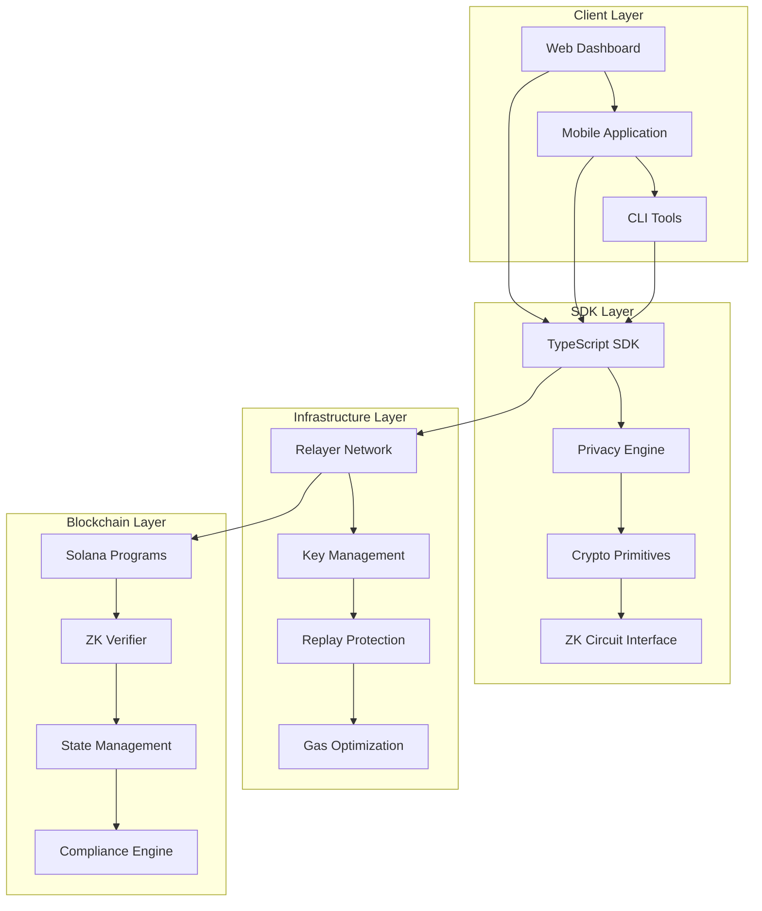
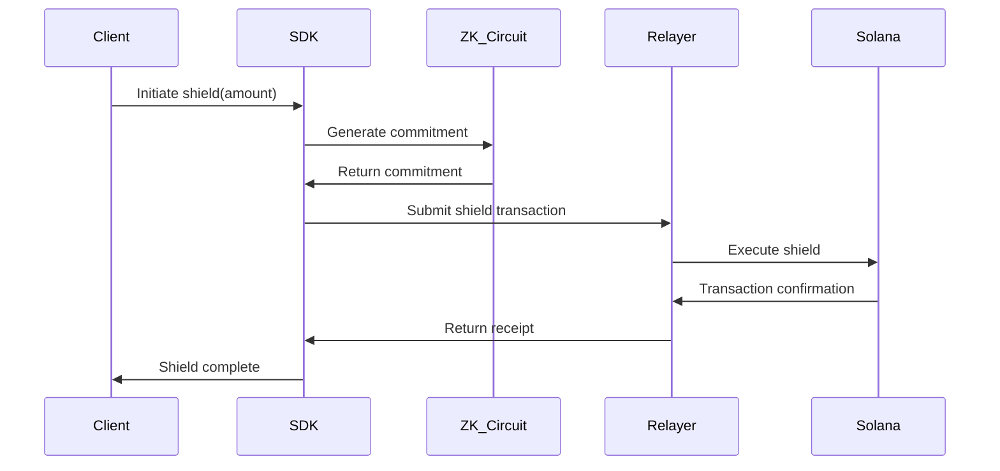
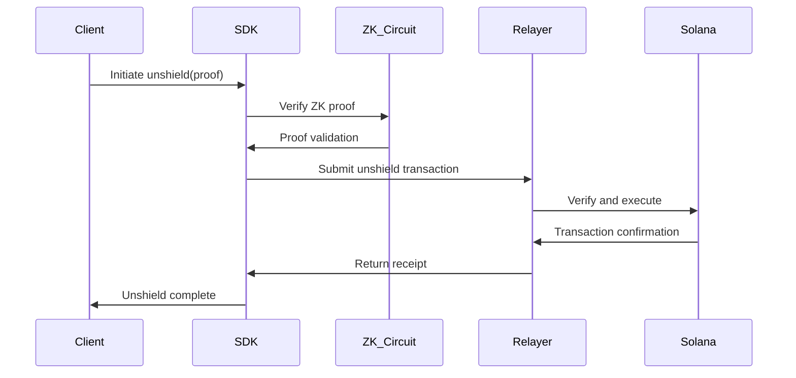

# SolVoid Architecture Documentation

## System Architecture Overview

SolVoid implements a multi-layered privacy architecture designed for enterprise-grade deployment on the Solana blockchain. The system integrates zero-knowledge cryptography, secure relayer infrastructure, and compliance mechanisms to provide comprehensive privacy solutions.

## High-Level Architecture



## Component Architecture

### 1. Zero-Knowledge Circuit Layer

#### Withdraw Circuit
```
Input Parameters:
- secret: 32-byte random value
- nullifier: 32-byte unique identifier
- amount: 64-bit transaction value
- merkle_path: 20-level authentication path
- merkle_root: 32-byte tree root

Processing:
1. Poseidon-3 Hash(secret || nullifier || amount) → commitment
2. Verify merkle_path against merkle_root
3. Generate nullifier hash for double-spend protection
4. Create Groth16 proof of knowledge

Output:
- zk_proof: Groth16 proof
- public_inputs: [nullifier_hash, merkle_root, amount]
```

#### Merkle Tree Circuit
```
Tree Structure:
- Depth: 20 levels (configurable)
- Hash Function: Poseidon-2
- Zero Hashes: Precomputed for efficiency
- Leaf Format: Poseidon-3 commitment

Operations:
- Insert: O(log n) complexity
- Verify: O(1) with path
- Update: O(log n) with proof
```

### 2. Smart Contract Architecture

#### Program Structure
```rust
pub struct SolVoidProgram {
    // State management
    merkle_roots: HashMap<u32, [u8; 32]>,
    nullifiers: HashSet<[u8; 32]>,
    
    // Economic controls
    circuit_breakers: HashMap<String, CircuitBreaker>,
    volume_limits: HashMap<String, VolumeLimit>,
    
    // Compliance
    privacy_scores: HashMap<[u8; 32], u8>,
    risk_thresholds: RiskThresholds,
}
```

#### Key Functions
- `initialize()`: Program initialization with configuration
- `shield()`: Deposit transaction with commitment
- `unshield()`: Withdrawal with ZK proof verification
- `rescue()`: Atomic wallet recovery protocol
- `update_privacy_score()`: Compliance scoring mechanism

### 3. Relayer Network Architecture

#### Relayer Components
```typescript
class PrivacyRelayer {
    // Core components
    keyManager: KeyManager;
    replayProtection: ReplayProtection;
    gasOptimizer: GasOptimizer;
    
    // Security features
    rateLimiter: RateLimiter;
    circuitBreaker: CircuitBreaker;
    auditLogger: AuditLogger;
    
    // Network interfaces
    solanaConnection: Connection;
    privateNetwork: PrivateNetwork;
}
```

#### Security Architecture
- **Multi-signature Authorization**: 3-of-5 threshold for critical operations
- **Hardware Security Modules**: Key protection with HSM integration
- **Network Isolation**: Private relayer network with VPN access
- **Audit Trail**: Complete transaction logging with tamper resistance

### 4. SDK Architecture

#### Client SDK Structure
```typescript
export class SolVoidSDK {
    // Core modules
    privacyEngine: PrivacyEngine;
    cryptoUtils: CryptoUtils;
    networkClient: NetworkClient;
    
    // Configuration
    config: SolVoidConfig;
    logger: Logger;
    
    // Methods
    async shield(amount: number, recipient: string): Promise<string>;
    async unshield(proof: ZKProof): Promise<string>;
    async scanTransactions(address: string): Promise<PrivacyReport>;
    async rescueWallet(signatures: string[]): Promise<string>;
}
```

## Data Flow Architecture

### Shield Transaction Flow


### Unshield Transaction Flow


## Security Architecture

### Cryptographic Security
- **Zero-Knowledge Proofs**: Groth16 with BN254 curve
- **Hash Functions**: Poseidon for ZK-friendly operations
- **Randomness**: Cryptographically secure RNG for secrets
- **Key Management**: Hierarchical deterministic wallet structure

### Network Security
- **TLS Encryption**: All network communications encrypted
- **Authentication**: Mutual TLS for relayer communications
- **Rate Limiting**: DoS protection at multiple layers
- **Circuit Breakers**: Automatic failure isolation

### Application Security
- **Input Validation**: Comprehensive parameter validation
- **Access Control**: Role-based permissions
- **Audit Logging**: Immutable transaction records
- **Error Handling**: Secure error reporting without information leakage

## Performance Architecture

### Optimization Strategies
- **Precomputed Values**: Zero hashes and common computations
- **Batch Processing**: Multiple transactions in single proof
- **Parallel Execution**: Concurrent circuit generation
- **Caching**: Frequently accessed data in memory

### Resource Management
- **Memory Efficiency**: Optimized data structures
- **Compute Budget**: Solana program optimization
- **Network Bandwidth**: Minimal data transmission
- **Storage Optimization**: Efficient state management

## Compliance Architecture

### Privacy Scoring System
```typescript
interface PrivacyScore {
    transactionPattern: number;    // 0-100
    timingAnalysis: number;        // 0-100
    amountDistribution: number;    // 0-100
    networkBehavior: number;       // 0-100
    
    overallScore: number;           // Weighted average
    riskLevel: 'LOW' | 'MEDIUM' | 'HIGH';
}
```

### Regulatory Features
- **Transaction Monitoring**: Real-time pattern analysis
- **Risk Assessment**: Automated scoring algorithms
- **Reporting**: Regulatory compliance reporting
- **Audit Trails**: Complete transaction history

## Deployment Architecture

### Multi-Environment Support
- **Development**: Local testing environment
- **Staging**: Pre-production testing
- **Production**: Mainnet deployment with full security

### Infrastructure Components
- **Load Balancers**: Traffic distribution
- **Database Systems**: Persistent state storage
- **Monitoring Systems**: Real-time health monitoring
- **Backup Systems**: Disaster recovery capabilities

## Integration Architecture

### API Design
```typescript
// Core API endpoints
interface SolVoidAPI {
    // Privacy operations
    shield(request: ShieldRequest): Promise<ShieldResponse>;
    unshield(request: UnshieldRequest): Promise<UnshieldResponse>;
    
    // Compliance operations
    getPrivacyScore(address: string): Promise<PrivacyScore>;
    scanTransactions(request: ScanRequest): Promise<ScanResponse>;
    
    // Rescue operations
    initiateRescue(request: RescueRequest): Promise<RescueResponse>;
    completeRescue(request: CompleteRequest): Promise<CompleteResponse>;
}
```

### Third-Party Integrations
- **Wallet Providers**: MetaMask, Phantom, Solflare
- **Exchanges**: Major cryptocurrency exchange APIs
- **Analytics**: Chain analysis and compliance tools
- **Oracles**: External data feeds for pricing

## Monitoring and Observability

### Metrics Collection
- **Transaction Metrics**: Volume, success rates, timing
- **Performance Metrics**: Latency, throughput, resource usage
- **Security Metrics**: Attack attempts, anomaly detection
- **Business Metrics**: User adoption, retention rates

### Alerting System
- **Real-time Alerts**: Critical system notifications
- **Threshold Monitoring**: Performance and security thresholds
- **Escalation Procedures**: Multi-level alert escalation
- **Incident Response**: Automated and manual response procedures

## Future Architecture Considerations

### Scalability Enhancements
- **Layer 2 Solutions**: Off-chain computation with on-chain verification
- **Sharding**: Horizontal scaling for increased throughput
- **Cross-Chain**: Multi-blockchain privacy solutions
- **Quantum Resistance**: Post-quantum cryptographic upgrades

### Feature Extensions
- **Multi-Asset Support**: Additional token types and NFTs
- **Advanced Privacy**: Recursive proofs and composability
- **DeFi Integration**: Privacy-preserving decentralized finance
- **Enterprise Features**: Advanced compliance and reporting tools

---

*Architecture Version: 1.1.0 | Last Updated: January 2026*
