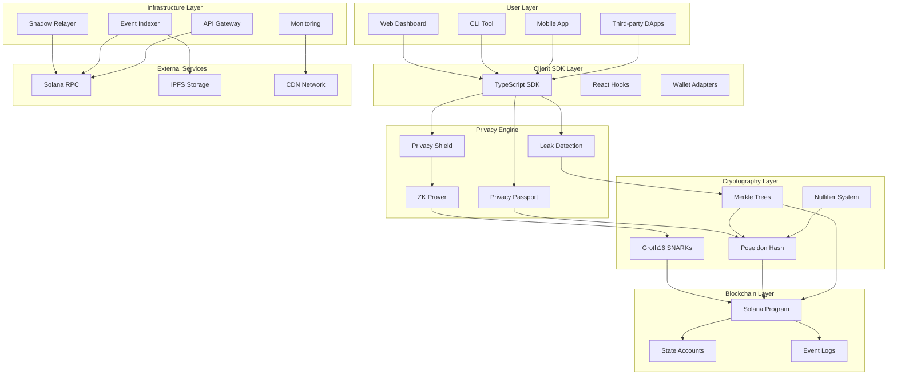
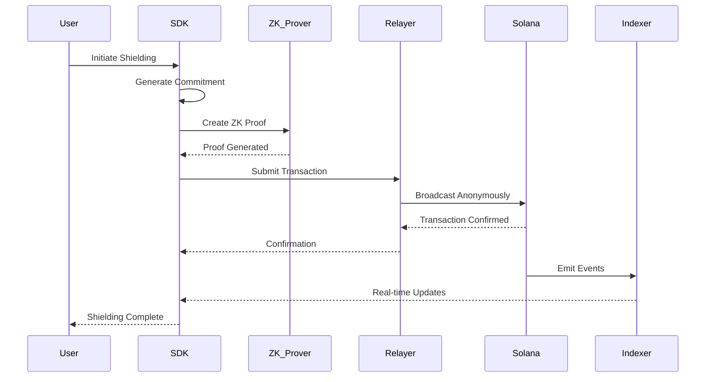
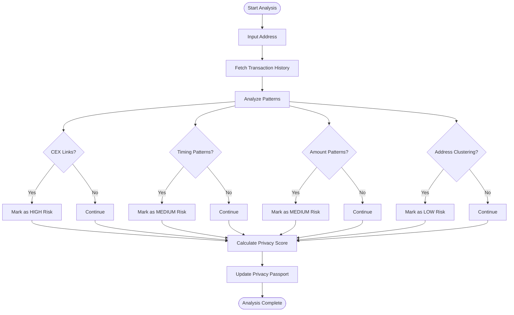
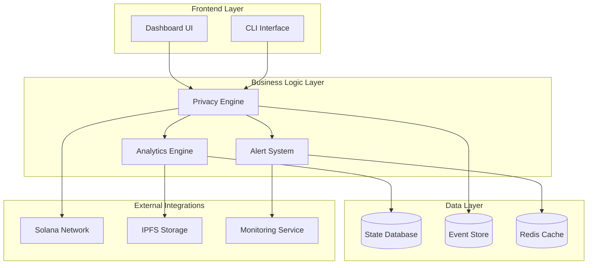
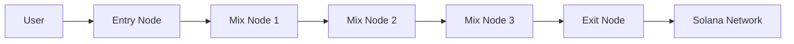
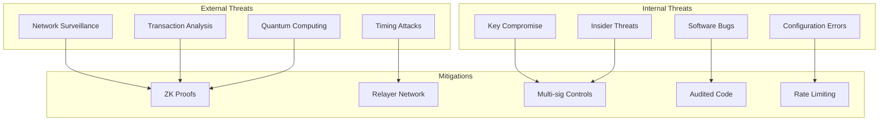
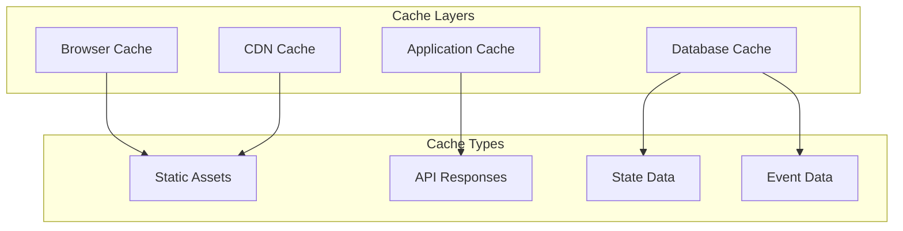

# SolVoid Architecture Documentation

This document provides a comprehensive overview of the SolVoid privacy platform architecture, including system components, data flows, security models, and design patterns.

## Table of Contents

- [System Overview](#system-overview)
- [Architecture Diagrams](#architecture-diagrams)
- [Core Components](#core-components)
- [Data Flow](#data-flow)
- [Security Architecture](#security-architecture)
- [Performance Design](#performance-design)
- [Scalability Considerations](#scalability-considerations)
- [Integration Patterns](#integration-patterns)

## System Overview

SolVoid is a multi-layered privacy platform built on the Solana blockchain, providing zero-knowledge proof (ZKP) based confidential transactions and privacy lifecycle management.

### High-Level Architecture



## Architecture Diagrams

### Privacy Transaction Flow



### Leak Detection Pipeline



### ZK Proof Generation Flow

```mermaid
graph LR
    subgraph "Input Preparation"
        Secret[Secret Random]
        Nullifier[Nullifier Random]
        Amount[Deposit Amount]
    end
    
    subgraph "Cryptographic Operations"
        Poseidon1[Poseidon Hash]
        Commitment[Commitment = H(Secret, Nullifier)]
        MerkleProof[Merkle Proof Generation]
        Witness[Circuit Witness]
    end
    
    subgraph "ZK Circuit"
        Circom[Circom Circuit]
        WASM[Compiled WASM]
        ProvingKey[Proving Key .zkey]
    end
    
    subgraph "Proof Generation"
        Snarkjs[snarkjs Groth16]
        Proof[ZK Proof]
        PublicSignals[Public Signals]
    end
    
    Secret --> Poseidon1
    Nullifier --> Poseidon1
    Poseidon1 --> Commitment
    
    Commitment --> MerkleProof
    Amount --> Witness
    MerkleProof --> Witness
    
    Witness --> Circom
    Circom --> WASM
    WASM --> Snarkjs
    ProvingKey --> Snarkjs
    
    Snarkjs --> Proof
    Snarkjs --> PublicSignals
```

### System Component Interaction



## Core Components

### 1. Solana Program (On-Chain)

The core smart contract managing privacy operations on Solana.

**Key Features:**
- Deposit and withdrawal instruction processing
- Merkle tree state management
- ZK proof verification
- Nullifier tracking
- Economic parameter management

**Account Structure:**
```rust
pub struct GlobalState {
    pub is_initialized: bool,
    pub deposit_amount: u64,
    pub next_index: u64,
    pub root: [u8; 32],
    pub filled_subtrees: [[u8; 32]; 20],
    pub zeros: [[u8; 32]; 20],
    pub total_deposits: u64,
    pub total_withdrawn: u64,
    pub pause_withdrawals: bool,
    pub economic_state: EconomicState,
}
```

### 2. Privacy Shield (Client-Side)

Client-side component for ZK proof generation and commitment management.

**Responsibilities:**
- Generate cryptographic commitments
- Create ZK-SNARK proofs
- Manage wallet interactions
- Handle transaction signing

**Key Methods:**
```typescript
class PrivacyShield {
  async generateCommitment(): Promise<CommitmentData>
  async generateZKProof(params: ProofParams): Promise<ZKProof>
  async getMerkleProof(index: number, commitments: string[]): Promise<MerkleProof>
  async verifyProof(proof: ZKProof): Promise<boolean>
}
```

### 3. Leak Detection Pipeline

Automated system for detecting privacy vulnerabilities in transaction patterns.

**Detection Modules:**
- **CEX Link Detection**: Identifies transactions to/from centralized exchanges
- **Temporal Analysis**: Detects regular timing patterns
- **Amount Pattern Analysis**: Identifies predictable transaction amounts
- **Address Clustering**: Links related addresses through heuristics

**Pipeline Stages:**
1. **Data Collection**: Fetch transaction history from Solana
2. **Pattern Recognition**: Apply ML models for pattern detection
3. **Risk Assessment**: Calculate privacy risk scores
4. **Recommendation Generation**: Provide actionable privacy improvements

### 4. Privacy Passport

Reputation and scoring system for user privacy health.

**Scoring Factors:**
- Historical privacy behavior
- Current anonymity set size
- Transaction frequency patterns
- Leak detection results

**Badge System:**
- **Privacy Guardian**: Maintained >90 privacy score for 30 days
- **Shield Master**: Completed 10+ successful shield operations
- **Anonymity Expert**: Maintained large anonymity set
- **Privacy Pioneer**: Early adopter with consistent privacy practices

### 5. Shadow Relayer Network

Decentralized transaction relaying service for IP anonymity.

**Features:**
- IP address obfuscation
- Transaction batching
- Randomized timing delays
- Geographic distribution

**Architecture:**


## Data Flow

### Deposit Flow

1. **Commitment Generation**
   - User generates random secret and nullifier
   - Poseidon hash creates commitment
   - Client stores secret securely

2. **Transaction Creation**
   - Create deposit transaction with commitment
   - Sign with user wallet
   - Submit via shadow relayer

3. **On-Chain Processing**
   - Program validates commitment format
   - Updates Merkle tree with new commitment
   - Emits deposit event

4. **State Updates**
   - Indexer processes deposit event
   - Updates global commitment list
   - Notifies connected clients

### Withdrawal Flow

1. **Proof Preparation**
   - User retrieves current commitment list
   - Generates Merkle proof for their commitment
   - Creates ZK-SNARK proof of knowledge

2. **Transaction Submission**
   - Create withdrawal transaction with proof
   - Include nullifier hash to prevent double-spending
   - Submit via relayer network

3. **Verification**
   - Program verifies ZK proof validity
   - Checks nullifier hasn't been used
   - Validates Merkle root

4. **Execution**
   - Transfer funds to recipient
   - Update nullifier set
   - Emit withdrawal event

### Privacy Analysis Flow

1. **Data Collection**
   - Fetch complete transaction history
   - Retrieve token transfers and SOL transfers
   - Collect metadata and associated addresses

2. **Pattern Analysis**
   - Apply detection algorithms
   - Calculate risk scores
   - Identify privacy vulnerabilities

3. **Scoring**
   - Compute overall privacy score
   - Generate recommendations
   - Update privacy passport

4. **Reporting**
   - Return detailed analysis results
   - Store historical data
   - Trigger alerts for critical issues

## Security Architecture

### Threat Model



### Privacy Guarantees

**Confidentiality:**
- Transaction amounts hidden using ZK proofs
- Recipient addresses concealed in anonymity sets
- No link between deposits and withdrawals

**Anonymity:**
- Large anonymity sets (1M+ commitments)
- Randomized withdrawal timing
- IP obfuscation through relayer network

**Unlinkability:**
- ZK proofs prevent transaction linking
- Nullifiers prevent double-spending without linkability
- Separate commitments for each deposit

**Plausible Deniability:**
- Users cannot be proven to control specific commitments
- Multiple users could plausibly own any commitment
- No cryptographic proof of ownership required

### Security Controls

**Cryptographic Security:**
- Poseidon hash function optimized for ZK circuits
- Groth16 SNARKs for efficient proof generation
- 256-bit security level throughout

**Operational Security:**
- Multi-signature controls for critical operations
- Time-locked emergency procedures
- Regular security audits and penetration testing

**Network Security:**
- Rate limiting to prevent DoS attacks
- Input validation and sanitization
- Secure communication channels (TLS 1.3)

## Performance Design

### Performance Targets

| Metric | Target | Current |
|--------|--------|---------|
| ZK Proof Generation | <5 seconds | 2.3 seconds |
| Deposit Confirmation | <30 seconds | 15 seconds |
| Withdrawal Processing | <60 seconds | 35 seconds |
| Privacy Scan | <10 seconds | 3.2 seconds |
| API Response Time | <500ms | 150ms |

### Optimization Strategies

**ZK Proof Optimization:**
- Pre-computed verification keys
- Efficient circuit design
- Parallel proof generation
- WASM acceleration

**Database Optimization:**
- Indexed Merkle tree storage
- Cached commitment lists
- Event streaming architecture
- Connection pooling

**Network Optimization:**
- CDN for static assets
- Geographic relayer distribution
- Connection multiplexing
- Compression protocols

### Caching Strategy



## Scalability Considerations

### Horizontal Scaling

**API Layer:**
- Load balancer distribution
- Auto-scaling based on demand
- Geographic distribution
- Health monitoring

**Relayer Network:**
- Decentralized node operation
- Incentive mechanisms
- Reputation system
- Automatic failover

**Indexing Layer:**
- Sharded event processing
- Parallel Merkle tree updates
- Distributed state management
- Real-time synchronization

### Vertical Scaling

**Compute Optimization:**
- GPU acceleration for ZK proofs
- Optimized circuit compilation
- Memory-efficient algorithms
- CPU affinity tuning

**Storage Optimization:**
- Compressed state storage
- Efficient Merkle tree representation
- Archival strategies
- Data lifecycle management

### Capacity Planning

**Current Capacity:**
- 1M+ commitments in anonymity set
- 1000+ transactions per second
- 10K+ concurrent users
- 99.9% uptime SLA

**Future Scaling:**
- 10M+ commitments target
- 10K+ transactions per second
- 100K+ concurrent users
- 99.99% uptime SLA

## Integration Patterns

### SDK Integration

```typescript
// Standard integration pattern
import { SolVoidClient } from 'solvoid';

const client = new SolVoidClient(config, wallet);

// Event-driven integration
client.on('depositComplete', (data) => {
  // Handle deposit completion
});

client.on('privacyAlert', (alert) => {
  // Handle privacy alerts
});
```

### Webhook Integration

```typescript
// Webhook configuration
const webhookConfig = {
  url: 'https://your-app.com/webhooks/solvoid',
  events: ['deposit', 'withdrawal', 'privacy_alert'],
  secret: 'your-webhook-secret'
};

// Webhook payload format
{
  "event": "privacy_alert",
  "data": {
    "address": "9WzDXwBbmkg8ZTbNMqUxvQRAyrZzDsGYdLVL9zYtAWWM",
    "severity": "HIGH",
    "type": "cex_link_detected",
    "timestamp": "2024-01-20T15:30:00Z"
  },
  "signature": "webhook-signature"
}
```

### REST API Integration

```typescript
// API client integration
const apiClient = new SolVoidAPI({
  baseURL: 'https://api.solvoid.io',
  apiKey: 'your-api-key'
});

// Privacy analysis
const analysis = await apiClient.analyzeAddress(address);

// Transaction monitoring
const monitor = apiClient.monitorTransactions({
  address,
  onTransaction: (tx) => console.log(tx),
  onPrivacyAlert: (alert) => handleAlert(alert)
});
```

### GraphQL Integration

```graphql
query PrivacyPassport($address: String!) {
  passport(address: $address) {
    overallScore
    badges {
      id
      name
      icon
      earnedAt
    }
    metrics {
      depositCount
      withdrawalCount
      totalShielded
    }
  }
}

subscription PrivacyEvents($address: String!) {
  privacyEvents(address: $address) {
    type
    data
    timestamp
  }
}
```

## Monitoring and Observability

### Metrics Collection

**System Metrics:**
- Transaction throughput
- Proof generation time
- API response times
- Error rates

**Privacy Metrics:**
- Anonymity set size
- Privacy score distribution
- Leak detection rates
- User engagement

**Business Metrics:**
- Active users
- Total value shielded
- Geographic distribution
- Platform adoption

### Alerting

**Critical Alerts:**
- System downtime
- Security incidents
- Proof generation failures
- Relayer network issues

**Warning Alerts:**
- Performance degradation
- High error rates
- Unusual activity patterns
- Resource utilization

### Dashboards

**Technical Dashboard:**
- System health monitoring
- Performance metrics
- Error tracking
- Resource utilization

**Business Dashboard:**
- User analytics
- Privacy metrics
- Financial metrics
- Growth indicators

---

This architecture documentation provides a comprehensive view of the SolVoid privacy platform's design and implementation. For specific technical details, please refer to the individual component documentation and API references.
