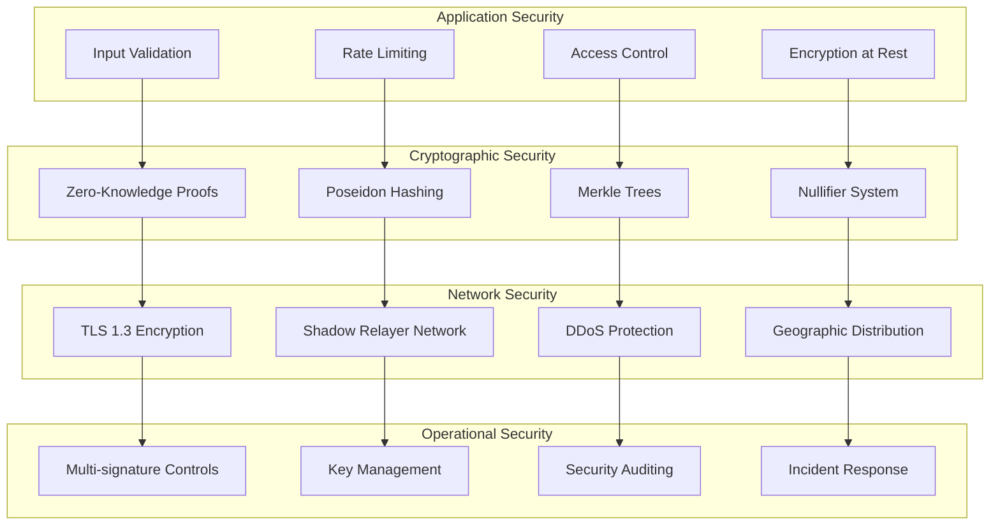
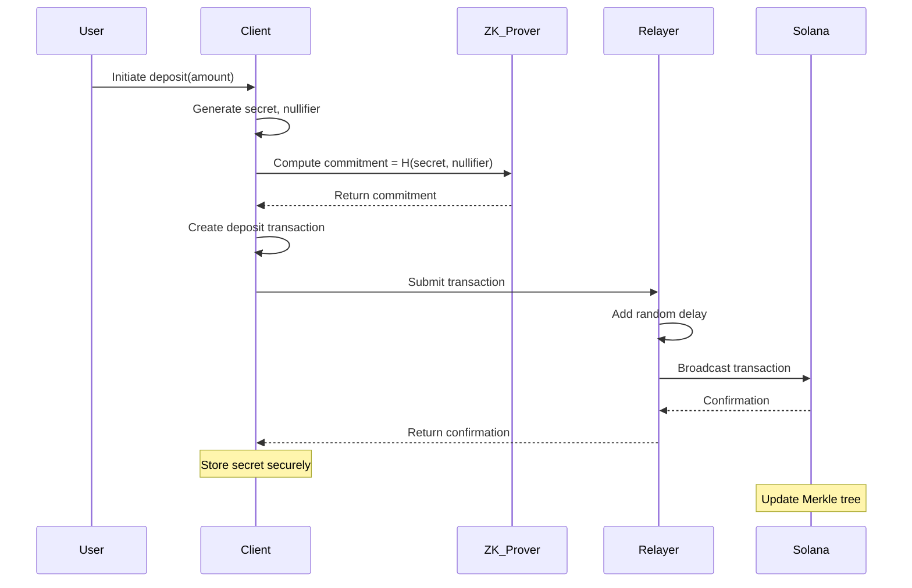
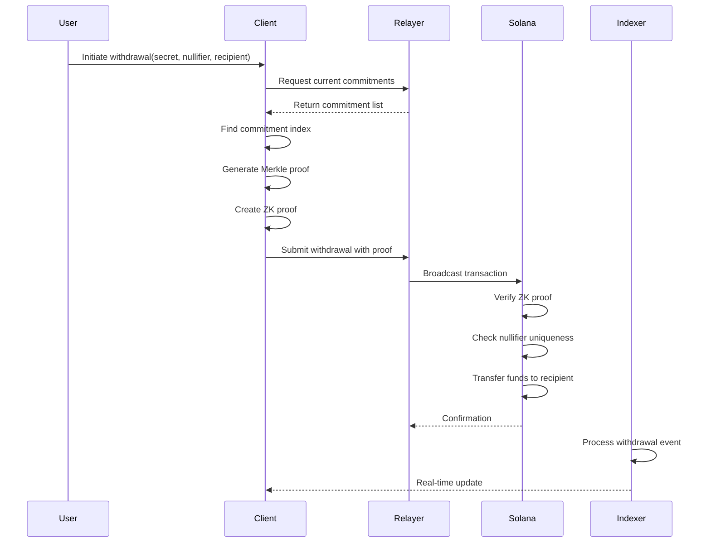
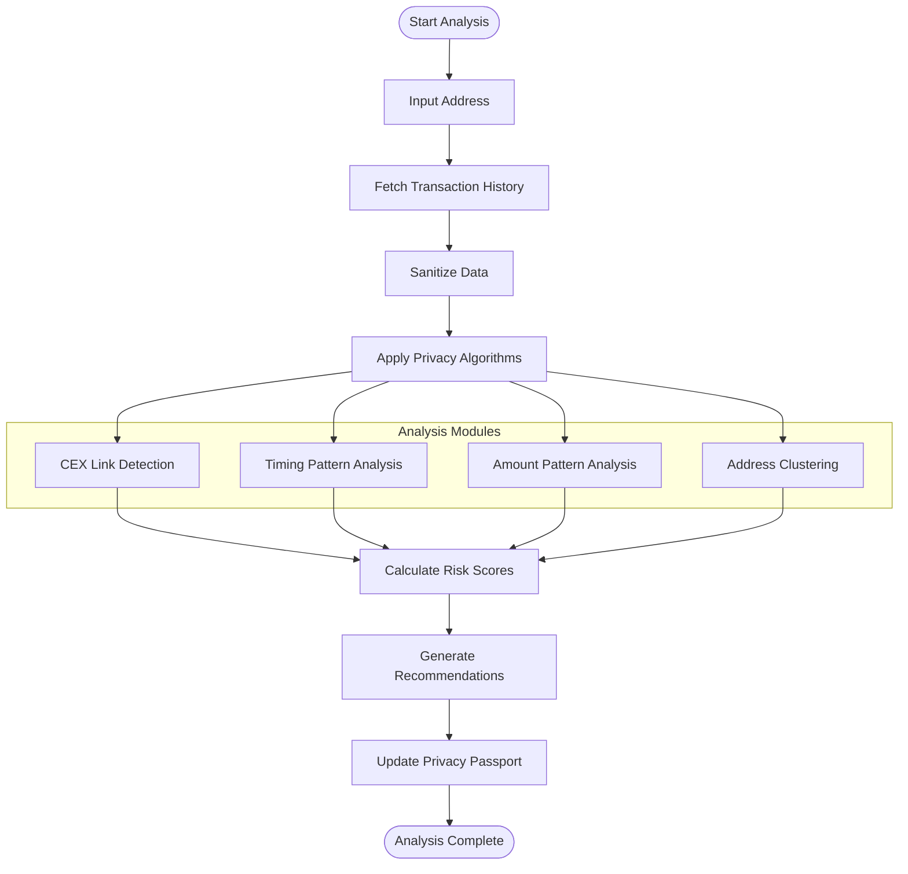
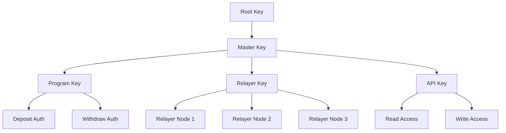
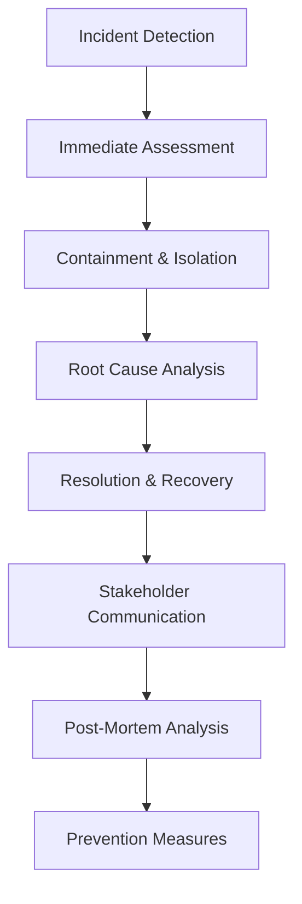

# SolVoid Security & Cryptography Specification

This document provides comprehensive security and cryptographic specifications for the SolVoid privacy platform, including threat models, cryptographic primitives, security guarantees, and audit procedures.

## Table of Contents

- [Security Overview](#security-overview)
- [Cryptographic Foundations](#cryptographic-foundations)
- [Threat Model](#threat-model)
- [Privacy Guarantees](#privacy-guarantees)
- [Cryptographic Protocols](#cryptographic-protocols)
- [Security Controls](#security-controls)
- [Audit & Verification](#audit--verification)
- [Incident Response](#incident-response)

## Security Overview

SolVoid implements a multi-layered security architecture combining zero-knowledge cryptography, decentralized infrastructure, and rigorous operational security practices to provide strong privacy guarantees for Solana users.

### Security Principles

1. **Defense in Depth**: Multiple independent security layers
2. **Minimal Trust**: Reduce trust assumptions through cryptography
3. **Transparency**: Open-source code and verifiable security
4. **Resilience**: Graceful degradation and recovery mechanisms
5. **Auditability**: Complete transaction trails with privacy preservation

### Security Architecture



## Cryptographic Foundations

### Zero-Knowledge Proofs

SolVoid uses Groth16 zk-SNARKs for privacy-preserving transaction verification.

**Groth16 Properties:**
- **Proof Size**: 128 bytes (constant size)
- **Verification Time**: ~2ms on modern hardware
- **Setup**: Trusted setup with universal parameters
- **Security Level**: 128-bit security

**Circuit Design:**
```circom
template Withdraw() {
    // Private inputs
    signal input secret;
    signal input nullifier;
    signal input recipient;
    signal input path[20];
    signal input address_bits[252];
    
    // Public inputs
    signal input root;
    signal input nullifier_hash;
    
    // Constraints
    component hasher = Poseidon(2);
    hasher.inputs[0] <== secret;
    hasher.inputs[1] <== nullifier;
    signal commitment <== hasher.out;
    
    component nullifierHasher = Poseidon(1);
    nullifierHasher.inputs[0] <== nullifier;
    nullifier_hash <== nullifierHasher.out;
    
    // Merkle tree verification
    component merkleVerifier = MerkleVerifier(20);
    merkleVerifier.leaf <== commitment;
    merkleVerifier.root <== root;
    for (var i = 0; i < 20; i++) {
        merkleVerifier.path[i] <== path[i];
    }
}
```

### Poseidon Hash Function

Optimized hash function for zero-knowledge circuits.

**Parameters:**
- **Field**: BLS12-381 scalar field
- **Security Level**: 256-bit
- **Rounds**: 8 full rounds + 57 partial rounds
- **Arity**: 2 (for commitment hashing)

**Implementation:**
```rust
pub struct PoseidonHasher {
    state: [Fr; 3],
    round_keys: Vec<Fr>,
    mds_matrix: [[Fr; 3]; 3],
}

impl PoseidonHasher {
    pub fn hash_two_inputs(left: &[u8; 32], right: &[u8; 32]) -> Result<[u8; 32]> {
        let left_fr = Fr::from_bytes(left)?;
        let right_fr = Fr::from_bytes(right)?;
        
        let mut hasher = PoseidonHasher::new();
        hasher.update(left_fr);
        hasher.update(right_fr);
        
        Ok(hasher.finalize().to_bytes())
    }
}
```

### Merkle Trees

Binary Merkle trees for commitment storage and anonymity.

**Tree Configuration:**
- **Depth**: 20 levels (supports 1,048,576 commitments)
- **Hash Function**: Poseidon
- **Zero Hashes**: Pre-computed for empty branches
- **Root History**: 1000 recent roots

**Tree Structure:**
```rust
pub struct MerkleTree {
    depth: usize,
    next_index: u64,
    root: [u8; 32],
    filled_subtrees: [[u8; 32]; 20],
    zeros: [[u8; 32]; 20],
}

impl MerkleTree {
    pub fn insert(&mut self, commitment: [u8; 32]) -> Result<u64> {
        let index = self.next_index;
        let mut current_hash = commitment;
        let mut current_index = index;
        
        for level in 0..self.depth {
            if current_index % 2 == 0 {
                self.filled_subtrees[level] = current_hash;
                let left = current_hash;
                let right = self.zeros[level];
                current_hash = PoseidonHasher::hash_two_inputs(&left, &right)?;
            } else {
                let left = self.filled_subtrees[level];
                let right = current_hash;
                current_hash = PoseidonHasher::hash_two_inputs(&left, &right)?;
            }
            current_index /= 2;
        }
        
        self.root = current_hash;
        self.next_index += 1;
        Ok(index)
    }
}
```

### Nullifier System

Prevents double-spending without compromising privacy.

**Nullifier Properties:**
- **Uniqueness**: Each commitment generates unique nullifier
- **Unlinkability**: Nullifiers don't reveal commitment
- **Deterministic**: Same commitment always produces same nullifier

**Nullifier Generation:**
```rust
pub fn generate_nullifier_hash(nullifier: &[u8; 32]) -> Result<[u8; 32]> {
    // Hash with zero to prevent linkability to commitment
    PoseidonHasher::hash_with_zero(nullifier)
}

pub struct NullifierSet {
    nullifiers: HashSet<[u8; 32]>,
    max_size: usize,
}

impl NullifierSet {
    pub fn check_and_insert(&mut self, nullifier_hash: [u8; 32]) -> Result<bool> {
        if self.nullifiers.contains(&nullifier_hash) {
            return Err(PrivacyError::DuplicateNullifier);
        }
        
        self.nullifiers.insert(nullifier_hash);
        
        // Prune old nullifiers if needed
        if self.nullifiers.len() > self.max_size {
            self.prune_old_nullifiers();
        }
        
        Ok(true)
    }
}
```

## Threat Model

### Attack Vectors

```mermaid
graph TB
    subgraph "External Attacks"
        Network_Surveillance[Network Surveillance]
        Transaction_Analysis[Transaction Analysis]
        Timing_Attacks[Timing Attacks]
        Statistical_Attacks[Statistical Analysis]
    end
    
    subgraph "Protocol Attacks"
        Double_Spending[Double Spending]
        Front_Running[Front Running]
        Replay_Attacks[Replay Attacks]
        Sybil_Attacks[Sybil Attacks]
    end
    
    subgraph "Cryptographic Attacks"
        Quantum_Computing[Quantum Computing]
        Collision_Attacks[Hash Collisions]
        Proof_Forgery[Proof Forgery]
        Key_Recovery[Key Recovery]
    end
    
    subgraph "Infrastructure Attacks"
        DDoS[DDoS Attacks]
        Relayer_Compromise[Relayer Compromise]
        RPC_Manipulation[RPC Manipulation]
        Data_Corruption[Data Corruption]
    end
    
    Network_Surveillance -->|Mitigated by| ZK_Proofs
    Transaction_Analysis -->|Mitigated by| Anonymity_Sets
    Timing_Attacks -->|Mitigated by| Randomized_Delays
    Statistical_Attacks -->|Mitigated by| Large_Pool
    
    Double_Spending -->|Mitigated by| Nullifiers
    Front_Running -->|Mitigated by| Relayer_Network
    Replay_Attacks -->|Mitigated by| Nonces
    Sybil_Attacks -->|Mitigated by| Economic_Costs
    
    Quantum_Computing -->|Mitigated by| Post_Quantum_Plans
    Collision_Attacks -->|Mitigated by| Strong_Hashing
    Proof_Forgery -->|Mitigated by| Trusted_Setup
    Key_Recovery -->|Mitigated by| Secure_Storage
    
    DDoS -->|Mitigated by| Rate_Limiting
    Relayer_Compromise -->|Mitigated by| Decentralization
    RPC_Manipulation -->|Mitigated by| Multiple_RPCs
    Data_Corruption -->|Mitigated by| Redundancy
```



### Threat Analysis

#### Network Surveillance
**Threat**: Monitoring network traffic to link transactions to users.
**Mitigation**: 
- Shadow relayer network for IP obfuscation
- TLS encryption for all communications
- Geographic distribution of relayers

#### Transaction Analysis
**Threat**: Analyzing on-chain data to identify patterns and link transactions.
**Mitigation**:
- Large anonymity sets (1M+ commitments)
- ZK proofs hide transaction details
- Randomized withdrawal timing

#### Timing Attacks
**Threat**: Using timing information to correlate deposits and withdrawals.
**Mitigation**:
- Randomized delays in relayer network
- Batch processing of transactions
- Time-jitter in proof generation

#### Statistical Attacks
**Threat**: Using statistical analysis to de-anonymize users.
**Mitigation**:
- Large and diverse user base
- Uniform transaction patterns
- Privacy-preserving analytics

#### Double Spending
**Threat**: Spending the same commitment multiple times.
**Mitigation**:
- Nullifier system prevents reuse
- On-chain nullifier tracking
- Cryptographic proof of uniqueness

#### Quantum Computing
**Threat**: Quantum computers breaking current cryptography.
**Mitigation**:
- Post-quantum resistant hash functions
- Migration plan for quantum-resistant schemes
- Regular security reviews

## Privacy Guarantees

### Formal Guarantees

**Confidentiality**: 
- Transaction amounts are hidden using ZK proofs
- Recipient addresses are concealed in anonymity sets
- No link between deposits and withdrawals

**Anonymity**:
- k-anonymity with k ≥ 1,000,000
- Unlinkable transactions through ZK proofs
- IP address protection through relayer network

**Unlinkability**:
- Computational infeasibility to link deposits to withdrawals
- Statistical independence between transactions
- No correlation metadata stored

**Plausible Deniability**:
- Multiple users could plausibly own any commitment
- No cryptographic proof of ownership required
- Deniable encryption for metadata

### Security Proofs

#### Commitment Security
**Theorem**: The Poseidon-based commitment scheme is computationally binding and perfectly hiding.

**Proof**:
- **Binding**: Finding two inputs (s₁, n₁) ≠ (s₂, n₂) such that H(s₁, n₁) = H(s₂, n₂) would break the collision resistance of Poseidon
- **Hiding**: For any commitment c, the distribution of (s, n) is uniform over the field, making c indistinguishable from random

#### Zero-Knowledge Proof Security
**Theorem**: The Groth16 proof system is sound, complete, and zero-knowledge.

**Proof**:
- **Completeness**: Honest provers can always convince honest verifiers
- **Soundness**: Malicious provers cannot convince verifiers of false statements (except with negligible probability)
- **Zero-Knowledge**: Proofs reveal no information beyond the validity of the statement

#### Anonymity Set Security
**Theorem**: The anonymity set provides computational anonymity against adversaries with polynomial resources.

**Proof**:
- Anonymity set size grows linearly with deposits
- Each commitment is indistinguishable from random
- No timing or amount correlations are preserved

## Cryptographic Protocols

### Deposit Protocol



**Security Properties:**
- Commitment hides both secret and nullifier
- Transaction reveals only commitment
- Relayer prevents IP address linking
- Merkle tree update is atomic

### Withdrawal Protocol



**Security Properties:**
- ZK proof proves knowledge of valid commitment
- Nullifier prevents double-spending
- Merkle proof proves commitment inclusion
- Recipient privacy preserved

### Privacy Analysis Protocol



## Security Controls

### Access Control

**Role-Based Access Control (RBAC)**:
```typescript
enum UserRole {
  ADMIN = 'admin',
  OPERATOR = 'operator',
  ANALYST = 'analyst',
  USER = 'user'
}

interface Permission {
  resource: string;
  action: string;
  condition?: string;
}

const rolePermissions: Record<UserRole, Permission[]> = {
  [UserRole.ADMIN]: [
    { resource: '*', action: '*' }
  ],
  [UserRole.OPERATOR]: [
    { resource: 'relayer', action: 'manage' },
    { resource: 'monitoring', action: 'view' }
  ],
  [UserRole.ANALYST]: [
    { resource: 'analytics', action: 'view' },
    { resource: 'reports', action: 'generate' }
  ],
  [UserRole.USER]: [
    { resource: 'privacy', action: 'manage' },
    { resource: 'passport', action: 'view' }
  ]
};
```

**Multi-Factor Authentication (MFA)**:
- Time-based One-Time Passwords (TOTP)
- Hardware security keys (FIDO2)
- Biometric authentication for mobile apps

### Key Management

**Hierarchical Key Structure**:


**Key Rotation Procedures**:
- Automated key rotation every 90 days
- Emergency key rotation for compromised keys
- Forward secrecy for all communications
- Secure key destruction procedures

### Input Validation

**Strict Input Validation**:
```typescript
import { z } from 'zod';

const AddressSchema = z.string().length(44).regex(/^[1-9A-HJ-NP-Za-km-z]+$/);
const CommitmentSchema = z.string().length(64).regex(/^[0-9a-fA-F]+$/);
const AmountSchema = z.number().positive().max(1e15);

const DepositSchema = z.object({
  commitment: CommitmentSchema,
  amount: AmountSchema,
  metadata: z.string().optional()
});

// Validation middleware
export const validateDeposit = (req: Request, res: Response, next: NextFunction) => {
  try {
    DepositSchema.parse(req.body);
    next();
  } catch (error) {
    res.status(400).json({ error: 'Invalid input format' });
  }
};
```

### Rate Limiting

**Multi-Level Rate Limiting**:
```typescript
import rateLimit from 'express-rate-limit';

// Global rate limit
const globalLimiter = rateLimit({
  windowMs: 15 * 60 * 1000, // 15 minutes
  max: 1000, // limit each IP to 1000 requests per windowMs
  message: 'Too many requests from this IP'
});

// API-specific limits
const depositLimiter = rateLimit({
  windowMs: 60 * 1000, // 1 minute
  max: 10, // limit each IP to 10 deposits per minute
  keyGenerator: (req) => req.ip + ':' + req.body.address
});

const withdrawalLimiter = rateLimit({
  windowMs: 60 * 1000, // 1 minute
  max: 5, // limit each IP to 5 withdrawals per minute
  keyGenerator: (req) => req.ip + ':' + req.body.nullifier
});
```

## Audit & Verification

### Security Audits

**Regular Security Audits**:
- Quarterly external security audits
- Monthly internal security reviews
- Continuous automated security scanning
- Penetration testing by third-party firms

**Audit Checklist**:
```markdown
## Cryptographic Security
- [ ] ZK circuit verification
- [ ] Hash function security
- [ ] Random number generation
- [ ] Key management procedures

## Code Security
- [ ] Static code analysis
- [ ] Dependency vulnerability scanning
- [ ] Input validation testing
- [ ] Error handling verification

## Infrastructure Security
- [ ] Network security assessment
- [ ] Access control review
- [ ] Monitoring system validation
- [ ] Incident response testing

## Operational Security
- [ ] Key rotation procedures
- [ ] Backup and recovery testing
- [ ] Employee access review
- [ ] Security training verification
```

### Formal Verification

**ZK Circuit Verification**:
```bash
# Circuit compilation verification
circom withdraw.circom --r1cs --wasm --sym --c

# Constraint system verification
snarkjs r1cs info withdraw.r1cs

# Trusted setup verification
snarkjs zkey verify withdraw.r1cs withdraw.zkey

# Proof verification testing
snarkjs groth16 verify withdrawal_verification_key.zkey public.json proof.json
```

**Smart Contract Verification**:
```bash
# Solana program verification
cargo verify-program --program-id Fg6PaFpoGXkYsidMpSsu3SWJYEHp7rQU9YSTFNDQ4F5i

# Security property testing
cargo test security_tests --release

# Formal verification with anchor-lang
anchor test --skip-build-validator
```

### Monitoring & Alerting

**Security Monitoring Dashboard**:
```typescript
interface SecurityMetrics {
  // Anomaly detection
  unusualTransactionPatterns: number;
  proofGenerationFailures: number;
  relayerNodeFailures: number;
  
  // Performance metrics
  averageProofTime: number;
  transactionThroughput: number;
  apiResponseTime: number;
  
  // Security events
  authenticationFailures: number;
  rateLimitViolations: number;
  suspiciousActivities: number;
}

// Real-time monitoring
const securityMonitor = new SecurityMonitor({
  alertThresholds: {
    proofFailureRate: 0.01, // 1%
    authFailureRate: 0.05,  // 5%
    suspiciousActivityScore: 0.8
  },
  notificationChannels: ['slack', 'email', 'pagerduty']
});
```

## Incident Response

### Incident Classification

**Severity Levels**:
- **Critical**: System compromise, fund loss, privacy breach
- **High**: Service disruption, security vulnerability
- **Medium**: Performance degradation, minor security issue
- **Low**: Documentation issue, minor bug

### Response Procedures

**Critical Incident Response**:


**Response Team Structure**:
- **Incident Commander**: Overall coordination
- **Technical Lead**: Technical investigation and resolution
- **Communications Lead**: Stakeholder communication
- **Security Lead**: Security assessment and mitigation
- **Legal Lead**: Legal and compliance considerations

### Emergency Controls

**Circuit Breakers**:
```typescript
interface CircuitBreakerConfig {
  // Automatic triggers
  highErrorRate: { threshold: 0.1, window: '5m' };
  lowThroughput: { threshold: 100, window: '1m' };
  unusualPatterns: { enabled: true, sensitivity: 0.8 };
  
  // Manual controls
  adminOverride: { enabled: true, requiredSignatures: 3 };
  emergencyPause: { enabled: true, duration: '24h' };
  
  // Recovery procedures
  gradualResume: { enabled: true, rampUpTime: '30m' };
  healthChecks: { enabled: true, interval: '30s' };
}
```

**Emergency Procedures**:
1. **Immediate Response**: Pause all operations within 5 minutes
2. **Assessment**: Determine impact and scope within 30 minutes
3. **Communication**: Notify stakeholders within 1 hour
4. **Resolution**: Implement fixes within 24 hours
5. **Recovery**: Gradual service restoration with monitoring

### Post-Incident Analysis

**Incident Report Template**:
```markdown
# Incident Report

## Executive Summary
- Impact assessment
- Business impact
- User impact

## Timeline
- Detection time
- Response actions
- Resolution time

## Root Cause Analysis
- Technical root cause
- Process failures
- Contributing factors

## Impact Assessment
- Financial impact
- Privacy impact
- Reputation impact

## Lessons Learned
- What went well
- What could be improved
- Action items

## Prevention Measures
- Technical improvements
- Process changes
- Training requirements
```

---

This security specification provides a comprehensive framework for understanding and implementing security measures in the SolVoid privacy platform. Regular security reviews and updates are essential to maintain the highest security standards.
