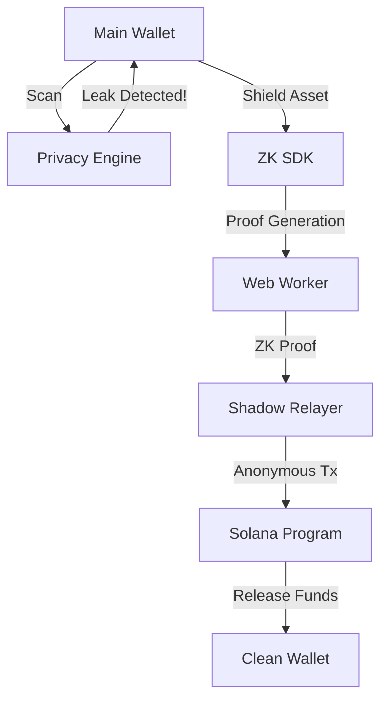

# System Architecture

SolVoid is built as a modular stack comprising an on-chain protocol, a deep-scanning engine, and a ZK-proving SDK.

## 1. The On-chain Protocol (Solana Program)
Built using Anchor, the program manages the global state of the "Shadow Vault".

### Key Components:
- **Merkle Tree State**: A persistent binary Merkle tree (depth 20) that stores hashes of deposited "notes".
- **Nullifier Records**: Persistent PDA entries (`[b"nullifier", hash]`) that ensure a note can only be withdrawn once.
- **Root History**: A ring buffer of the last 20 roots to allow for asynchronous proof generation.

## 2. Privacy Scan Engine (The SDK)
The engine performs multi-layered forensic analysis of transaction data.

### Analysis Pipeline:
1. **Instruction Dissection**: Decoding raw instruction data using on-chain IDLs.
2. **Account Trace**: Mapping every account involved to known "Identity Sinks" (CEXs, Bridge Vaults, NFT Minting tools).
3. **Inner Instruction Analysis**: Detecting CPI (Cross-Program Invocation) links that propagate identity secretly.
4. **MEV Forensics**: Checking if the transaction was included in a block via Jito or other private bundles.

## 3. ZK Shielding Pipeline (Cryptography)
We use **Groth16** SNARKs for high performance and minimal on-chain verification costs.

### The Proof Lifecycle:
1. **Deposit**: User hashes `(secret, nullifier)` to create a leaf on-chain.
2. **Scan**: User retrieves the Merkle Path (siblings) for their leaf from an indexer.
3. **Prove**: The SDK generates a ZK proof that they know the `secret` for a leaf that exists in a valid Merkle Root, without revealing which leaf it is.
4. **Relay**: The proof is sent to a **Shadow Relayer** who pays for the gas and submits the withdrawal on-chain.

## 4. Logical Interaction Flow

## 5. Security Model
- **Non-Custodial**: Neither the relayer nor the protocol ever has access to your `secret`.
- **Double-Spend Protection**: Enforced by PDA-based nullifiers at the runtime level.
- **Proof Composition**: Circuit constraints ensure the withdrawal address is bound to the proof, preventing "proof-stealing" front-running.
