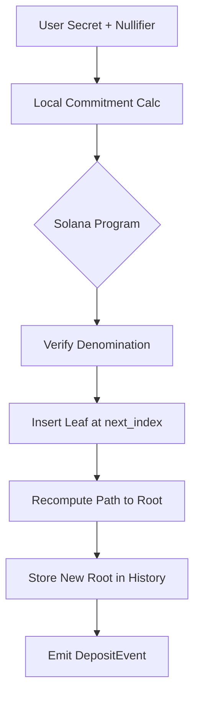
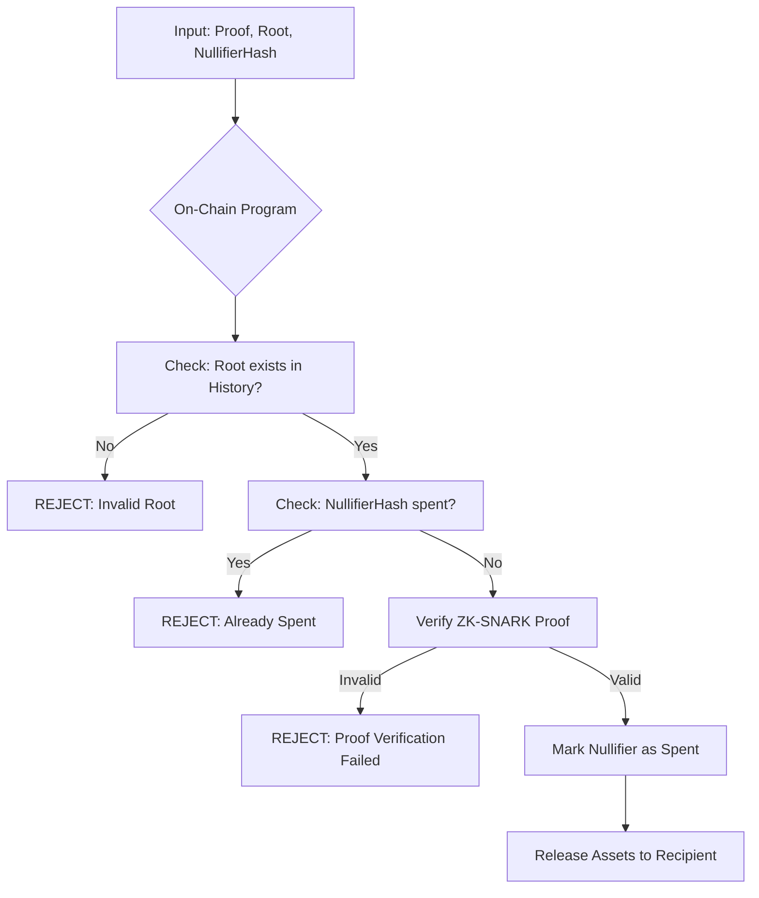

# TECHNICAL SPECIFICATION: SHADOW VAULT ARCHITECTURE

[DOCUMENT_CLASS: INTERNAL_TECH_SPEC] | [REVISION: 2.0]

This document details the cryptographic and structural implementation of the SolVoid Shadow Vault.

---

## 1. CRYPTOGRAPHIC PRIMITIVES

### 1.1 ZERO-KNOWLEDGE PROOFS (GROTH16)
SolVoid utilizes the Groth16 zk-SNARK protocol for its efficiency and minimal proof size (approximately 131 bytes). This is critical for Solana's transaction size constraints.

*   **Proving System**: R1CS (Rank-1 Constraint System).
*   **Curve**: BN128 (Alt-Bn128).
*   **Input Masking**: Computation is performed locally; the blockchain only receives the Proof `[A, B, C]` and the Public Signals (Nullifier Hash, Root).

### 1.2 COMMITMENT SCHEME
Deposits are represented as a leaf in the state tree.
*   **Commitment** = `Poseidon(Secret, Nullifier)`
*   **Nullifier Hash** = `Poseidon(Nullifier, Nullifier)` (used during withdrawal for double-spend prevention).

---

## 2. STATE MANAGEMENT

### 2.1 INCREMENTAL MERKLE TREE
The vault maintains a fixed-depth Merkle tree to track the history of all deposits.

| Parameter | Value | Description |
| :--- | :--- | :--- |
| **Depth** | 20 | Supports ~1 million maximum deposits. |
| **Hash Function** | Keccak-256 | Optimized for on-chain verification speed. |
| **History Size** | 30 | Maintains the last 30 roots to allow for asynchronous proof submission. |

### 2.2 LOGICAL FLOW: DEPOSIT

### 2.3 LOGICAL FLOW: WITHDRAWAL

---

## 3. FORENSIC SCANNING ENGINE (PRIVACY PASSPORT)

The scanning engine operates on a weighted penalty system to generate the **Privacy Score**.

### 3.1 DETECTION LAYERS
1.  **Transport Layer**: Analyzes RPC metadata and IP-RPC correlations (if available via Relayer logs).
2.  **Instruction Layer**: Scans for serialized Pubkeys in `data` buffers.
3.  **State Layer**: Traces ownership records across non-system programs (Metaplex, Jupiter, Phoenix).

### 3.2 SCORING ALGORITHM
The score `S` is calculated as:
`S = 100 - Σ(Penalty_i * Multiplier_i)`
Where:
*   `Penalty_i` is the base deduction for a leak type (Identity: -30, Metadata: -15).
*   `Multiplier_i` is the frequency amplifier (1.2x for recurring leaks).

---

## 4. RELAYER MASKING PROTOCOL

To prevent IP-leakage during transaction broadcast, SolVoid utilizes a "Shadow Relay" pattern.

1.  **Encrypted Tunneling**: The client encrypts the transaction payload using the Relayer's public key.
2.  **Multi-Hop Routing**: Relayers can optionally route the transaction through multiple internal nodes before reaching the Solana TPU (Transaction Processing Unit).
3.  **Bounty Settlement**: The Relayer deducts their fee directly from the withdrawal amount, removing the need for the user to fund the withdrawal gas from a linked wallet.

---
[ARCHITECTURE_VERIFIED] | [SECURITY_THRESHOLD: HIGH]
