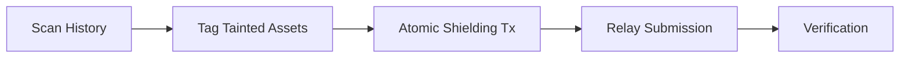

# SHIELDING WORKFLOW: SURGICAL RESCUE OPERATIONS

[DOCUMENT_CLASS: OPERATIONAL_PROCEDURE] | [REVISION: 1.2]

Surgical Rescue is an automated procedure designed to identify and neutralize identity leaks by migrating tainted assets into the SolVoid Shadow Vault.

---

## 1. WORKFLOW OVERVIEW

The rescue operation follows a strict structural pipeline to ensure zero identity leakage during the transition phase.



---

## 2. STEP-BY-STEP EXECUTION

### PHASE 1: FORENSIC IDENTIFICATION
The system scans for "Entropy Markers"—transactions where the user's public key is permanently associated with a specific asset through instruction data or account state.

### PHASE 2: ATOMIC BUNDLING
Instead of multiple individual deposits, the Rescue engine bundles shielding operations to reduce the transaction footprint. This makes it harder for external observers to correlate volumes with specific shielding events.

### PHASE 3: SHADOW BROADCAST
All rescue transactions should ideally be broadcast via the **Shadow Relayer**. This prevents the user's IP address from being associated with the transaction at the RPC level.

```bash
# Execute a full rescue with shadow broadcasting enabled
npx solvoid-scan rescue <ADDRESS> --shadow-rpc
```

---

## 3. ASSET DENOMINATION & ANONYMITY

SolVoid utilizes a **Fixed-Denomination Architecture** to maximize the size of the Anonymity Set.

| Denomination | Use Case | Anonymity Multiplier |
| :--- | :--- | :--- |
| **0.1 SOL** | Micro-transfers / Testing | 1.0x |
| **1.0 SOL** | Standard Retail Use | 2.5x |
| **10.0 SOL** | Institutional / HNW | 5.0x |
| **100.0 SOL** | Protocol-level Liquidity | 10.0x |

**Note**: Using the standard 1.0 SOL denomination is recommended as it maintains the largest crowd of participants (Anonymity Set).

---

## 4. TROUBLESHOOTING & EDGE CASES

*   **Broadcast Timeout**: If using `--shadow-rpc`, network latency may cause timeouts. Use a high-performance relay URL via `--relayer`.
*   **Partial Shielding**: If an asset amount does not perfectly match a denomination, the remaining balance will be left in the public wallet unless the `--force-change` flag (experimental) is used.

---
[PROCEDURE_VERIFIED] | [SECURITY_THRESHOLD: OPTIMAL]
