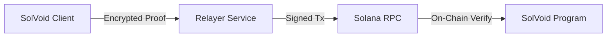

# API SPECIFICATION: SOLVOID RELAYER SERVICE

[VERSION: 1.1.0] | [PROTOCOL: JSON-RPC over HTTPS] | [SECURITY: ENCRYPTED]

The SolVoid Relayer Service facilitates anonymous interaction between the user's client and the Solana blockchain by abstracting IP addresses and gas management.

---

## [1] SERVICE ARCHITECTURE

The Relayer functions as a buffer, preventing the Solana RPC from correlating a user's IP address with their withdrawal transaction.



---

## [2] ENDPOINT SPECIFICATIONS

### GET `/commitments`
Fetches the current state of the Merkle Tree. Essential for the client to construct a local membership proof.

*   **Request**: `GET /commitments`
*   **Response (200 OK)**:
    ```json
    {
      "commitments": [
        "0x...hex_string",
        "0x...hex_string"
      ],
      "root": "0x...current_merkle_root",
      "treeDepth": 20,
      "totalDeposits": 1024
    }
    ```

### POST `/relay-withdraw`
Submits a ZK-Proof to the relayer for broadcast.

*   **Request Body**:
    ```json
    {
      "proof": {
          "pi_a": ["string", "string", "string"],
          "pi_b": [["string", "string"], ["string", "string"], ["string", "string"]],
          "pi_c": ["string", "string", "string"]
      },
      "publicSignals": {
          "nullifierHash": "string (hex)",
          "root": "string (hex)",
          "recipient": "string (base58)",
          "fee": "string (u64)"
      }
    }
    ```
*   **Response (202 Accepted)**:
    ```json
    {
      "status": "pending",
      "txid": "string (Solana Signature)",
      "estimatedFinality": "2 seconds"
    }
    ```

### POST `/webhook`
Dedicated endpoint for Geyser-based real-time block notifications.

*   **Purpose**: Allows the relayer's internal indexer to update its local Merkle tree state immediately upon a new on-chain deposit.

---

## [3] RELAYER FEE CONFIGURATION

Relayers are incentivized through a "Service Bounty" (`fee` parameter). 

1.  **Deduction Logic**: If a user withdraws 1.0 SOL and sets a fee of 0.01 SOL, the relayer receives 0.01 SOL, and the recipient address receives 0.99 SOL.
2.  **Minimum Fee**: Relayers advertise their minimum required fee via a local config or `/info` endpoint (optional).

---

## [4] OPERATIONAL COMPLIANCE

Enterprise Relayers must adhere to the following privacy standards:
*   **No Persistence**: Transaction hashes and proofs must not be logged to disk after confirmation.
*   **Encrypted Headers**: Users are encouraged to interface with relayers via HTTPS with TLS 1.3.
*   **IP Masking**: Relayers should ideally broadcast to the Solana network via a rotating set of VPN addresses or private TPU entries.

---
[SPEC_STATUS: FINAL] | [AUTH: PROTOCOL_TEAM]
