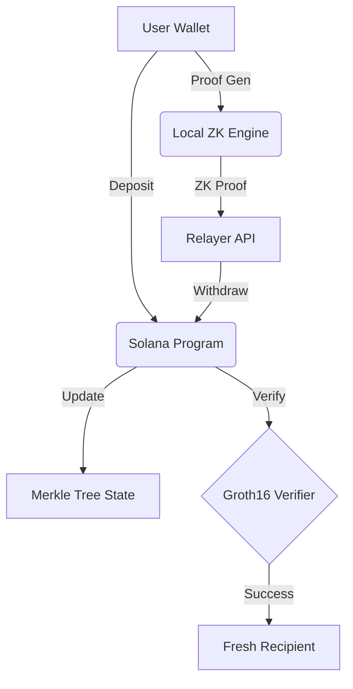

# Development & Deployment Guide

This guide is for protocol engineers looking to build, test, and deploy the SolVoid privacy stack.

## 1. Environment Setup

### Prerequisites
- **Node.js**: >= 16.x
- **Rust**: 1.75.0 or later
- **Solana CLI**: 1.18.x
- **Circom**: 2.1.0 (for circuit compilation)
- **SnarkJS**: `npm install -g snarkjs`

### Installation
```bash
git clone https://github.com/solvoid/solvoid
cd solvoid
npm install
```

## 2. ZK Circuit Masterclass

The withdrawal logic is enforced via Groth16 ZK-SNARKs.

### Build Circuits
Run the automated build script to compile circuits and generate proving keys:
```bash
chmod +x scripts/build-zk.sh
./scripts/build-zk.sh
```

**What this does:**
1. Compiles `program/circuits/withdraw.circom` to WASM and R1CS.
2. Downloads the Powers of Tau file (Phase 1).
3. Performs Circuit-Specific Setup (Phase 2).
4. Exports the `verification_key.json`.

## 3. On-Chain Program (Anchor)

The Solana program manages the Merkle tree and verifies ZK-proofs.

### Build and Test
```bash
cd program
cargo build-sbf
cargo test
```

**Key Files:**
- `program/src/lib.rs`: Core logic for deposits, Merkle updates, and withdrawals.
- `program/Cargo.toml`: Protocol dependencies including `groth16-solana`.

## 4. Running Tests

### SDK Unit Tests (Jest)
Test the privacy engine, IDL registry, and masking logic.
```bash
npm test
```

### Mock Mode Integration
Verify the CLI flow without spending real SOL:
```bash
npx ts-node cli/solvoid-scan.ts protect [ADDRESS] --mock
```

## 5. Deployment Workflow

1.  **Deploy Program**: `solana program deploy target/deploy/solvoid.so`
2.  **Initialize State**: Call the `initialize` instruction with the desired denomination (e.g., 1 SOL).
3.  **Start Relayer**: Configure `.env` with the new `PROGRAM_ID` and run `ts-node tools/relayer-service.ts`.
4.  **Distribute SDK**: Update `sdk/client.ts` with the production verification keys.

## 6. Architecture Overview



---
**Security Note**: For production deployments, a decentralized trusted setup (Ceremony) should be performed for the ZK proving keys.
